# Let's Write a Train Tracking Algorithm

This is a repo containing materials for [my](https://twocentstudios.com) presentation for [iOSDC 2025](https://fortee.jp/iosdc-japan-2025/proposal/a5e991ef-fec8-420b-8da8-de1f38c58182) in Tokyo, Japan.

Slides|Video (EN)|Video (JP)
-|-|-
[Speaker Deck](https://speakerdeck.com/twocentstudios/lets-write-a-train-tracking-algorithm)|(coming soon)|(coming soon)

- The `presentation` folder contains the presentation materials, with the raw markdown file for [Deckset](https://www.deckset.com/) and all images.
- `train-tracker-talk.xcodeproj` is the Xcode Project containing targets for 5 iOS apps used to collect data and 1 macOS app and algorithm used to display and process the data.

## Why does this repo exist?

My presentation has very little code. Each part of the algorithm is explained at a high level with maps and diagrams. If you're interested in seeing this looks in Swift, the code in this repo shows that it's not smoke and mirrors (although the code is not production-ready).

If you're working on an app that's using Core Location's [significant location change](https://developer.apple.com/documentation/corelocation/cllocationmanager/startmonitoringsignificantlocationchanges()) APIs or Core Motion's [motion activity](https://developer.apple.com/documentation/coremotion/cmmotionactivitymanager) APIs, these apps can serve as off-the-shelf data collection tools or reference implementations to help you get started or to visualize the shape of data that is available.

## Getting started

- Regenerate the project using [XcodeGen](https://github.com/yonaskolb/XcodeGen) and `project.yml`.
- Format the code with [SwiftFormat](https://github.com/nicklockwood/SwiftFormat) and `.swiftformat`.
- Apps require iOS 18+, macOS 15+, Xcode 16.4+.
- SQLite reading/writing is implemented on top of [SQLiteData](https://github.com/pointfreeco/sqlite-data).

## Data

The Tokyo-area static railway data used by *SessionViewer* and the tracking algorithm is *not* open source and not included in this repo. It is available through the [Public Transportation Open Data Center](https://www.odpt.org/).

Journey data for use with the tracking algorithm can be recorded with the `StartEndLocation` app (see below) by installing the app and riding a train.

# Projects

The apps included in this repo were created for educational, algorithm development, and debugging purposes. The result of this research is the production app [Eki Live](https://apps.apple.com/jp/app/%E9%A7%85%E3%83%A9%E3%82%A4%E3%83%96/id6745218674), which does journey tracking the Tokyo Metropolitan Area.

## SessionViewer - macOS app

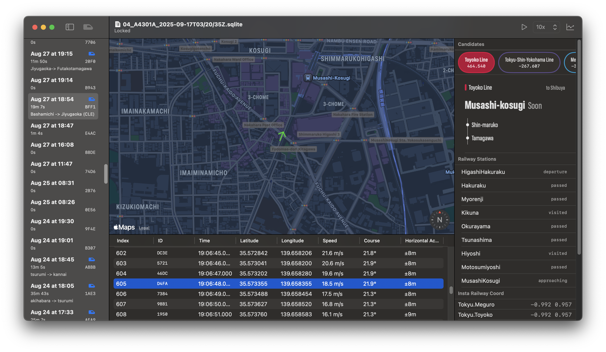

*SessionViewer* loads an SQLite file containing `Session`s and `Location`s produced by the iOS app *StartEndLocation* [04].

Clicking on a `Session` that represents a train journey will show its `Location`s in the main window and begin processing each `Location` with the algorithm in order to reconstruct the journey.

Click through `Location`s manually in the bottom panel or playback at variable speed by the clicking the play button in the top right.

## GroundTruthLogger [00]

List|Detail
-|-
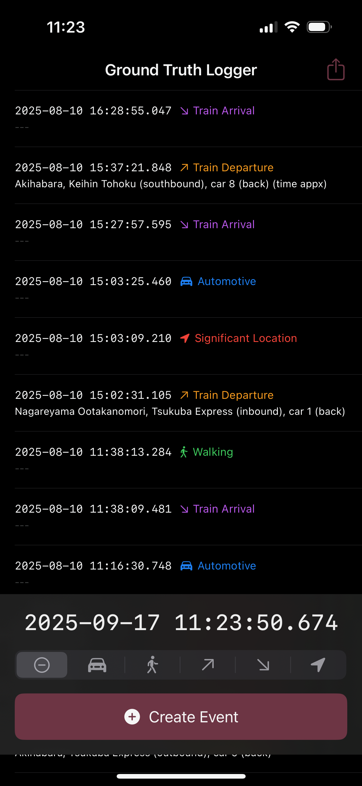|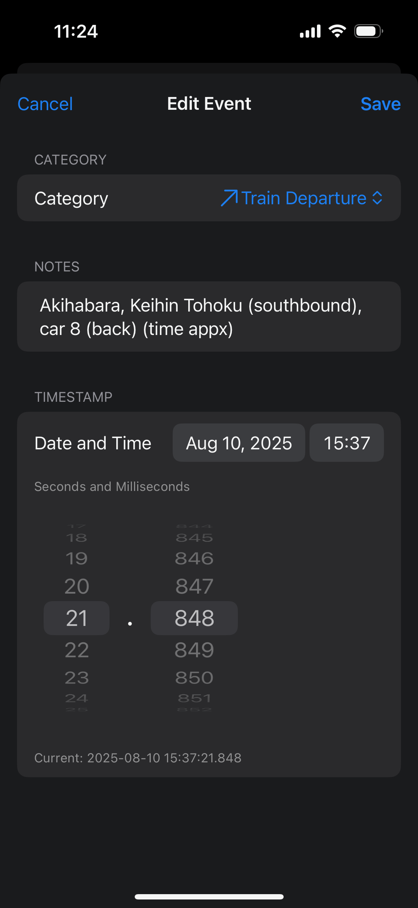

*GroundTruthLogger* is a simple app used by a human to log significant events observed in the human world while riding a train. This includes when a train actually departed and arrived down to the millisecond, and when the iPhone user started or stopped walking. Comparing these values to those produced by iPhone sensors is important to understand the characteristics of the iPhone sensors, especially while the sensors run in the background.

## SignificantChange [01]

List|Map
-|-
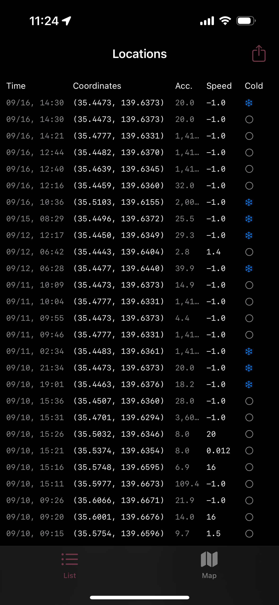|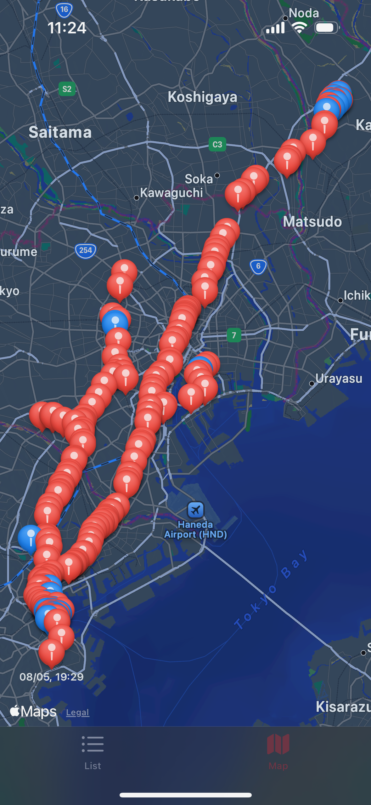

After granting location permissions, *SignificantChange* logs every significant location change `CLLocation` produced by Core Location, in the background or foreground. When in the background, the `CLLocation` will also be annotated with whether the app was cold launched.

This data is useful in understanding when and how often a significant location change event is triggered by the system, especially at times before, during, and after a train journey.

## SignificantStartLocation [02]

List|Detail
-|-
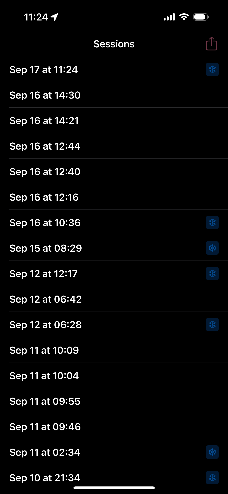|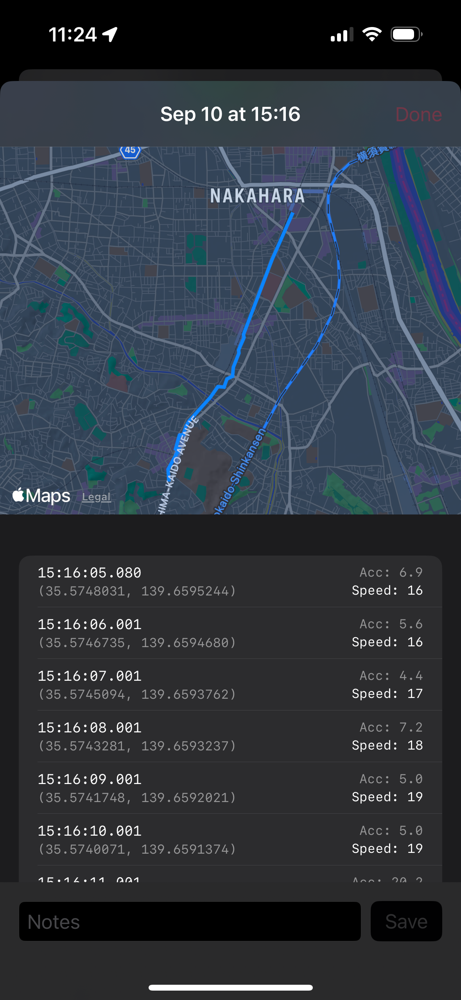

*SignificantStartLocation* is the same as *SignificantChange* [01], but, in addition, it will wake up the device's GPS after a significant location change event is delivered and record `CLLocation`s for about 3 minutes.

This data is useful for understanding how long it takes the GPS receiver to "warm up" and begin producing accurate data in many scenarios. In our use case, when the iPhone is not on a train, we want to detect this with the fewest number of `CLLocation`s possible as to keep battery impact low. When the iPhone *is* on a train, we want to understand exactly how long before `CLLocation`s become accurate enough to accurately determine the route.

## MotionActivity [03]

Live|Historical|Timeline
-|-|-
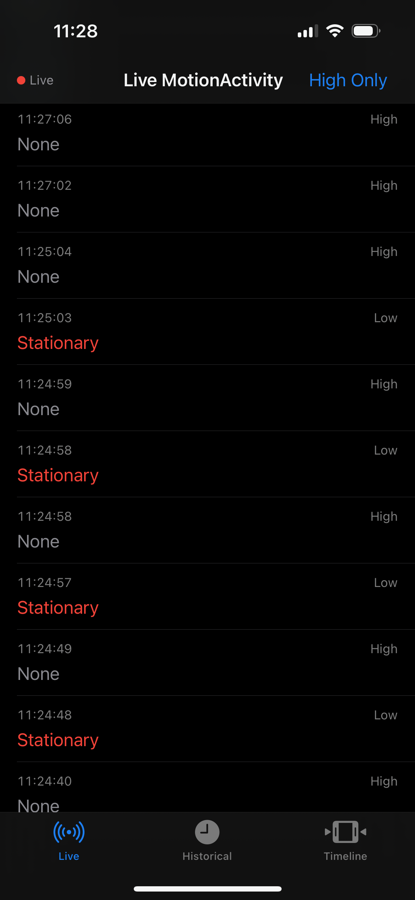|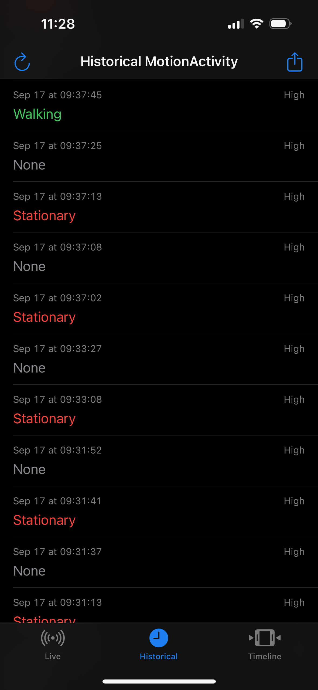|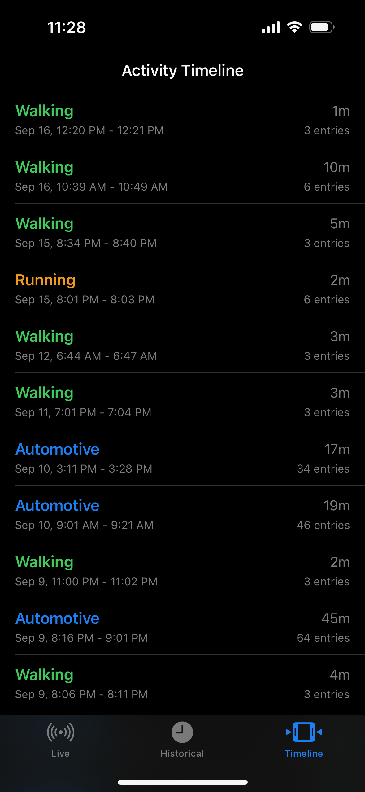

*MotionActivity* records raw data from the Core Motion framework. Core Motion produces various types of raw device motion data. However, we're mostly interested in the interpreted *motion activity*: does the iPhone think the user is stationary, walking, biking, or riding in an automobile?

When the app is in the foreground, the live *motion activity* results are streamed. In the background, the device is always storing motion activity data, and this app can fetch the full history. There's an additional view in the app that tries to sort and filter the raw historical data to be more understandable at a glance.

Motion activity is useful because we can use it to detect walking reasonably quickly. Walking is a good indicator that a user is no longer riding a train and we can stop recording `CLLocation`s from Core Location and mark the `Session` as complete.

## StartEndLocation [04]

List|Detail Locations|Detail Motion
-|-|-
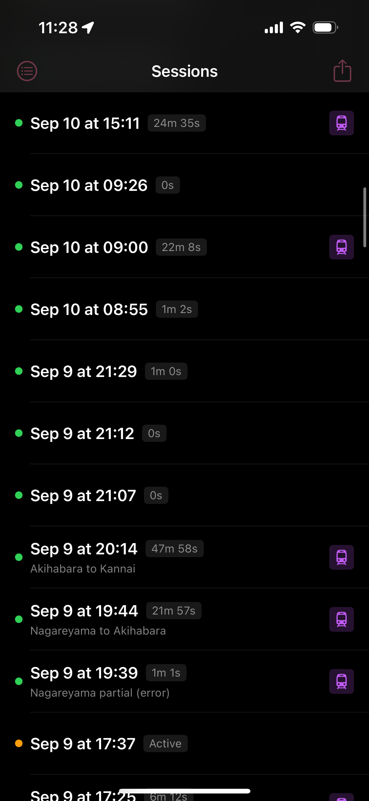|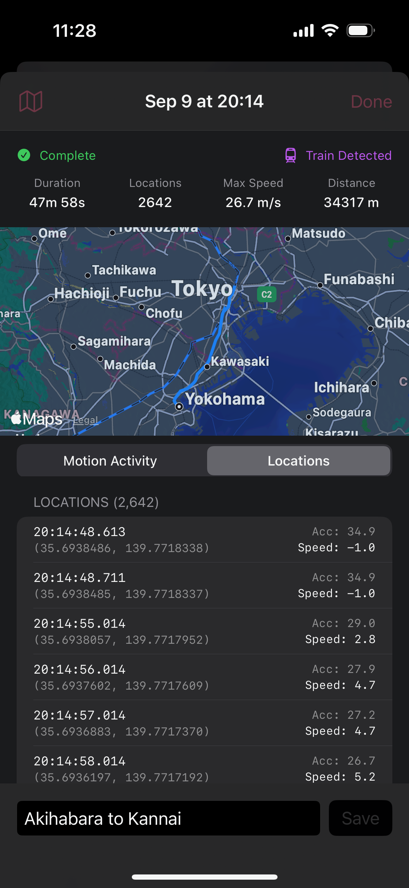|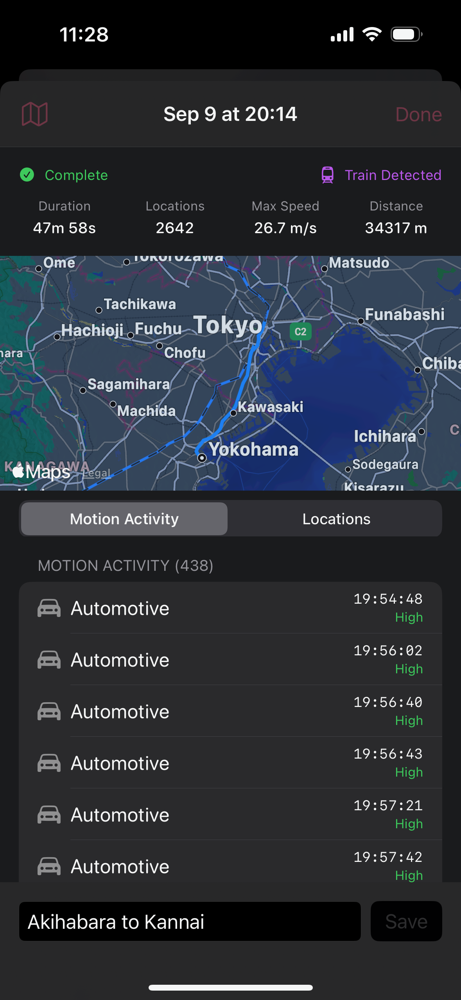

*StartEndLocation* combines the learnings from the previous 4 apps into an app that:

1. Automatically wakes up in the background.
2. Starts recording `CLLocation`s for a train journey.
3. Stops recording automatically when the user begins walking.
4. Exports the data as an SQLite file for use in *SessionViewer*.

# License

Code is available under the MIT License.
