# Let's Write a Train Tracking Algorithm

^ Hi, I'm Chris, and today we're going to write a train tracking algorithm.
^ Lately I've been working on an app called Eki Live.
^ In this presentation I'm going to talk about one part of that app.

---

# What is a train tracking algorithm?

^ So what do I mean by train tracking algorithm?
^ Well, when riding a train, it's useful to know the upcoming station.

---

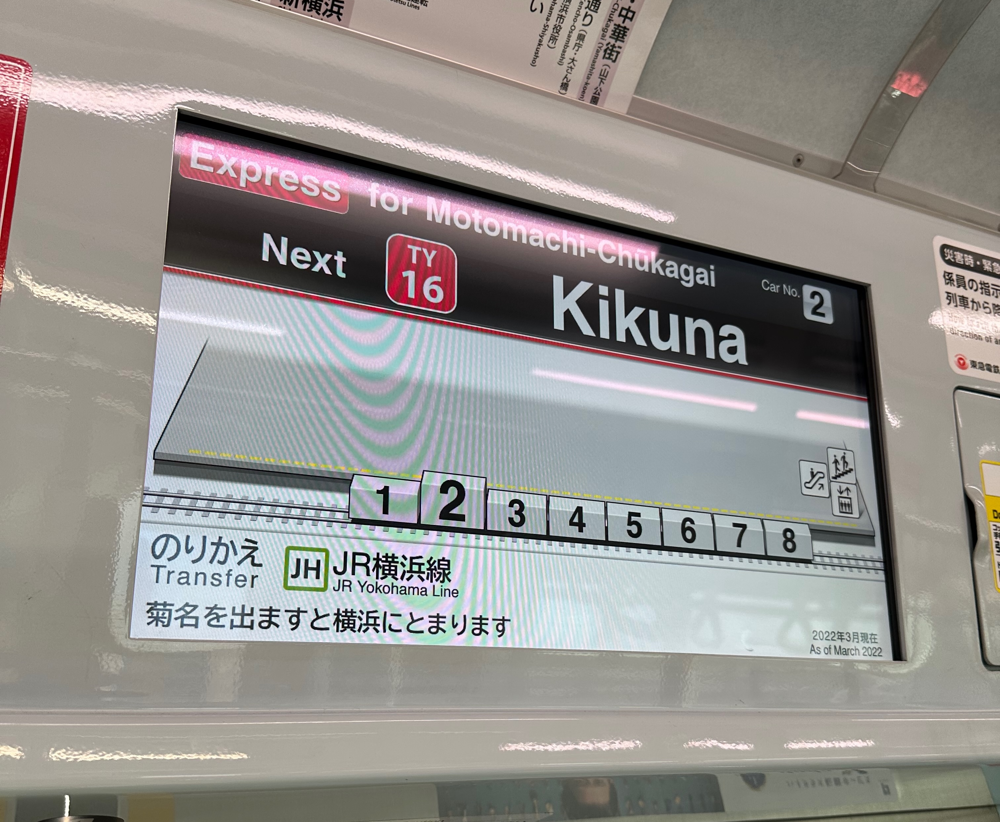

^ On the train, we can see the train information display or listen for announcements.

---


^ But would it also be useful to see this information in your Dynamic Island?

---

# **Talk Overview**

1. Review Data Prerequisites
2. Write Algorithm

^ In my talk, we'll first review the data prerequisites we'll need for the algorithm.
^ Then, we'll write each part of the algorithm, improving it step-by-step.

---

# Data Prerequisites

- Static railway data
- Live GPS data from an iPhone on a train

^ We need two types of data for the train tracking algorithm:
^ static railway data and Live GPS data from the iPhone user

---

# Static railway data


- **Railways**
- **Stations**
- Railway Directions
- Railway Coordinates

^ Railways are ordered groups of Stations.
^ In this example, we can see that the Minatomirai Line is made up of 6 stations.

---

# Static railway data


- Railways
- Stations
- **Railway Directions**
- **Railway Coordinates**

^ Trains travel in both Directions on a Railway.
^ Coordinates make up the path of a Railway's physical tracks.

---


^ This map shows the railway data we'll be using.

---

# GPS data


- Local SQLite Database
- `sessions` & `locations` tables

^ We collect live GPS data from an iPhone using the Core Location framework.
^ We store the data in a local SQLite database.

---

# Location


^ A `Location` has all data from CLLocation.
^ Latitude, longitude, speed, course, accuracy.

---

# *Session*


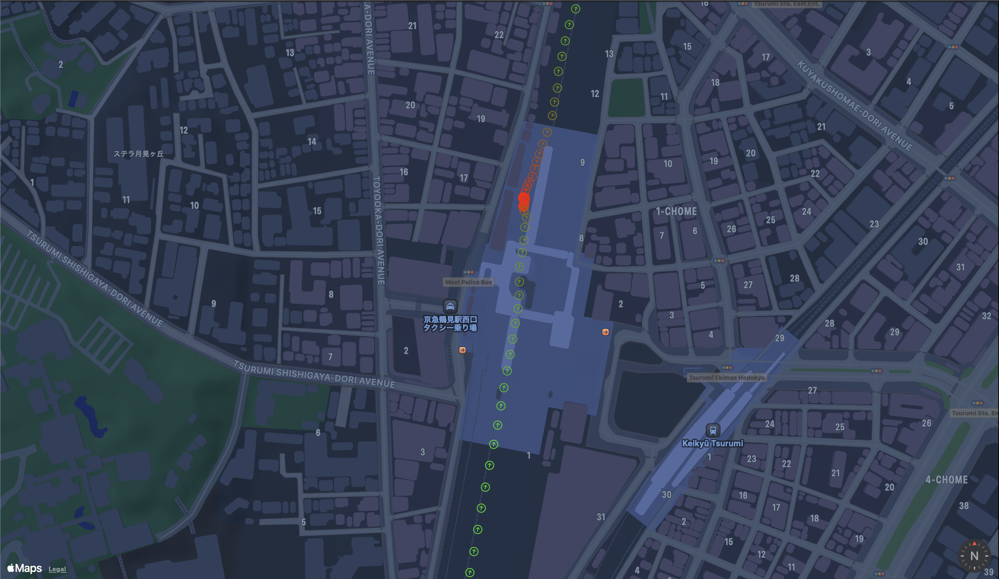

^ A Session is an ordered list of Locations.
^ A Session represents a possible journey.
^ The green is for fast and red is for stopped.

---


^ I created a macOS app to visualize the raw data.

---


^ In the left sidebar there is a list of Sessions.

---

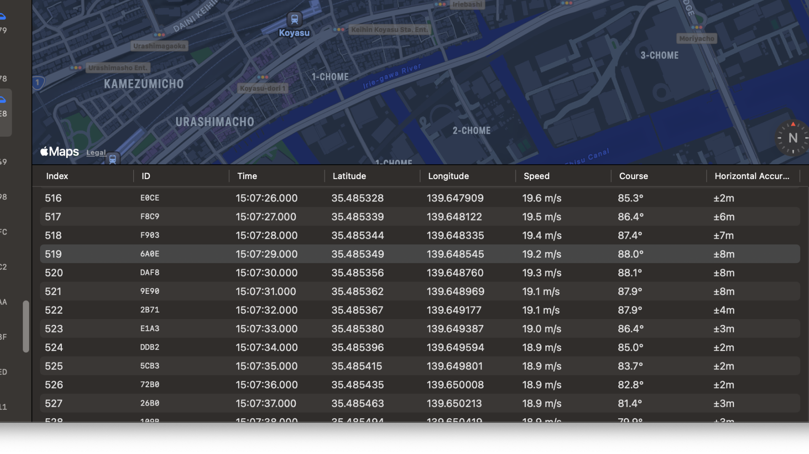

^ In the bottom panel there is a list of ordered Locations for a Session.
^ Clicking on a Location shows its position and course on the map.

---

# Write Algorithm

1. Determine Railway
2. Determine Direction
3. Determine Next Station

^ Our goal is to make an algorithm that determines 3 types of information:
^ The railway, the direction of the train, and the next or current station.

---

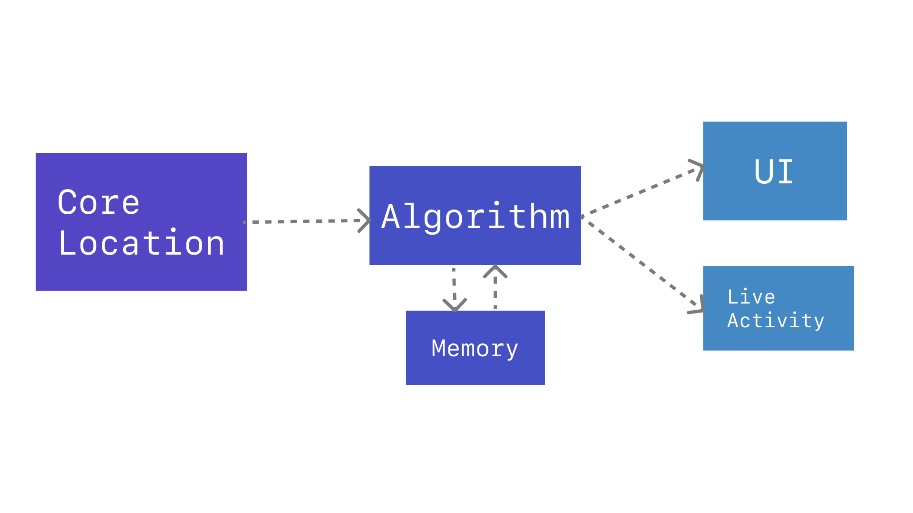

^ Here is a brief overview of the system.

---

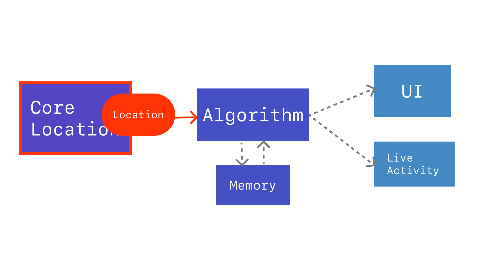

^ The app channels Location values to the algorithm.

---


^ The algorithm reads the Location and gathers information from its memory

---


^ The algorithm updates its understanding of the device's location in the world.

---


^ The algorithm calculates a new result set of railway, direction, and station phase.
^ The result is used to update the app UI and Live Activity.

---

# Example 1


- Railway: Toyoko Line
- Direction: Inbound (to Shibuya)
- Next station: Tsunashima

^ Let's start by considering a single Location.
^ I captured this Location while riding the Toyoko Line close to Tsunashima Station.

---

1. **Determine Railway**
2. Determine Railway Direction
3. Determine Next/Current Station

^ Can we determine the Railway from this Location?

---


^ We have coordinates that outline the railway.

---

# Railway Algorithm V1

- Find closest Railway Coordinates to Location
- Sort railways by nearest

^ First, we find the closest RailwayCoordinate to the Location for each Railway.
^ Then, we order the railways by which RailwayCoordinate is nearest.

---

Railway|Distance from Location (m)
-|-
Tokyu Toyoko|12.19
Tokyu Shin-Yokohama|177.19
Yokohama Green|1542.94
Tokyu Meguro|2266.07

^ Here are our results.

---


^ The closest RailwayCoordinate is the Toyoko Line is only about 12 meters away.
^ The next closest RailwayCoordinate is the Shin-Yokohama Line about 177 meters away.

---


^ We did it!
^ Our algorithm works well for this case

---

However...

^ but...

---

# Example 2


- Railway: Toyoko Line
- Direction: Outbound (to Yokohama)
- Next station: Hiyoshi

^ Let's consider another Location.
^ This Location was also captured on the Toyoko Line.

---

Problem: Toyoko Line and Meguro Line run parallel


^ But in this section of the railway track, the Toyoko Line and Meguro Line run parallel.
^ It's not possible to determine whether the correct line is Toyoko or Meguro from just this one Location.

---

We need **history**


^ The algorithm needs to use all Locations from the journey.
^ The example journey follows the Toyoko Line for longer than the Meguro Line.
^ We can see this at the top.

---

# Railway Algorithm V2

- Convert distance to score
- Add scores over time

^ First, we convert the distance between the Location and the nearest railway coordinate to a score
^ The score is high if close and exponentially lower when far.
^ Then, we add the scores over time.

---

## Railway Algorithm V2

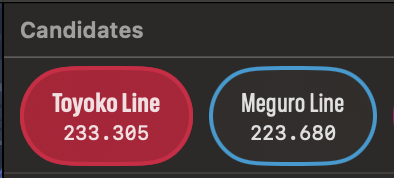

^ The score from Nakameguro to Hiyoshi is now higher for the Toyoko Line than the Meguro Line.

---


^ We did it!
^ Our algorithm works well for this case

---

However...

^ but...

---

# Example 3


- Railway: Keihin-Tohoku Line
- Direction: Northbound
- Next station: Kamata

^ Let's consider a third Location.
^ This Location was captured on the Keihin-Tohoku Line which runs the east corridor of Tokyo.

---

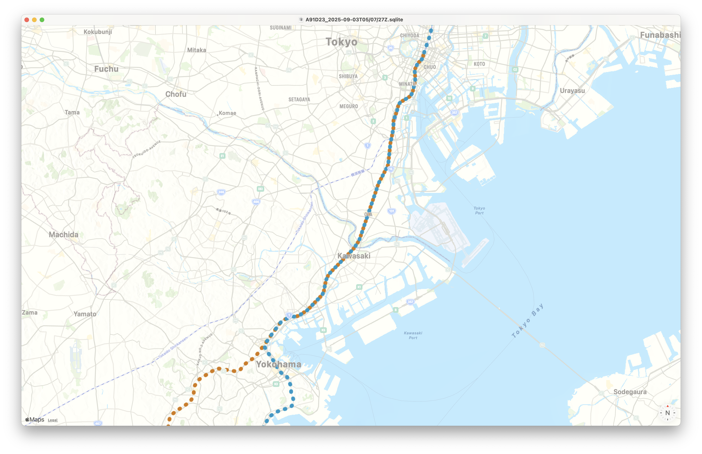

^ Several lines run parallel in this corridor.
^ The Tokaido Line follows the same track as the Keihin-Tohoku Line

---


^ But the Tokaido Line skips many stations.

---

# *Equal?! 🤔* 


^ If we only compare railway coordinate proximity scores, the scores will be the same.

---

# Railway Algorithm V3

- Add penalty for passed stations
- Add penalty for stopping between stations

^ Let's add a small penalty to the score if a station is passed.
^ If a station is passed, that indicates the iPhone may be on a parallel express railway.
^ Let's also add a small penalty to the score if a train stops between stations.
^ If a train stops between stations, that indicates the iPhone may be on a parallel local railway.

---

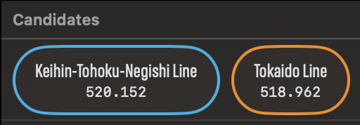

^ Using this algorithm, the Keihin-Tohoku score is now slightly larger than the Tokaido score.

---

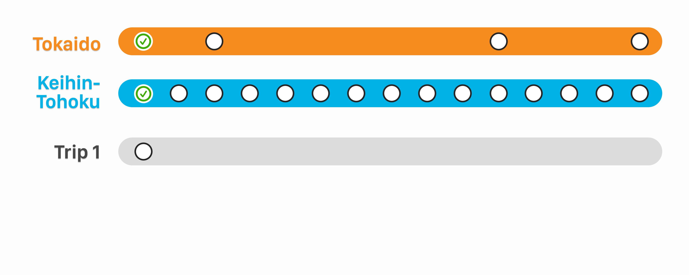

^ Let's consider two example trips to better understand penalties
^ For an example trip 1 that starts at Tokyo...

---

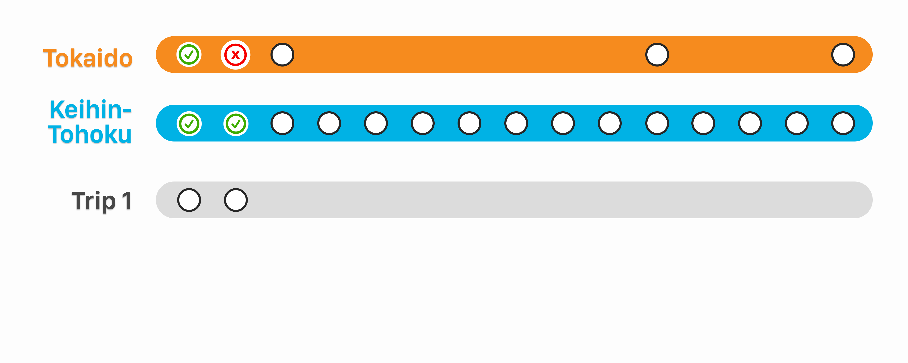

^ The train stops at the 2nd Keihin-Tohoku station.
^ The Tokaido score receives a penalty since the stop occurs between stations.

---


^ As we continue...

---


^ The Tokaido score receives many penalties.
^ The algorithm determines the trip was on the Keihin-Tohoku Line.

---

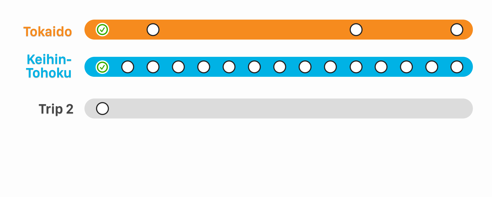

^ For an example trip 2 that starts at Tokyo...

---


^ The train passes the 2nd Keihin-Tohoku station.
^ And the Keihin-Tohoku score receives a penalty.

---


^ As we continue...

---


^ The Keihin-Tohoku score receives many penalties.
^ The algorithm determines the trip was on the Tokaido Line.

---


^ Our algorithm works well for this case
^ できた！

---

There are many more edge cases but...

^ There are many more edge cases.

---

# Let's move on!

^ However, let's continue.

---

1. Determine Railway
2. **Determine Railway Direction**
3. Determine Next/Current Station

^ For each potential railway, we will determine which direction the train is moving.

---

Every Railway has **2 directions**

^ Every railway has 2 directions.

---

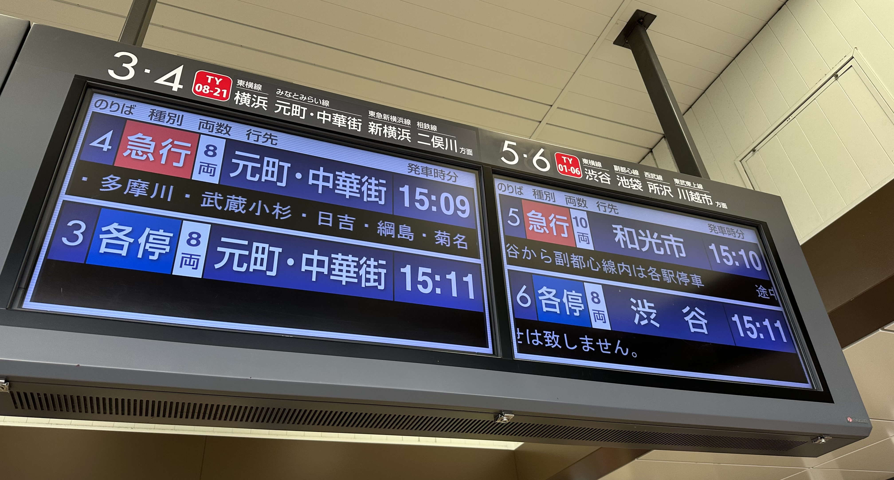

^ We're used to seeing separate timetables on the departure board.

---


^ For example, the Toyoko Line goes inbound towards Shibuya and outbound towards Yokohama.

---

# Example


- Railway: Toyoko Line
- Direction: Inbound (to Shibuya)
- Next station: Tsunashima

^ Let's consider a Location captured on the Toyoko Line going inbound to Shibuya.

---

# Direction Algorithm V1

- Mark timestamp for 2 stations
- Compare order of 1st and 2nd station

^ Once we have visited two stations, we can compare the temporal order the station visits.
^ If the visit order matches the order of the stations in the database, the iPhone is heading in the "ascending" direction.

---


^ The iPhone visited Kikuna and then Okurayama.

---

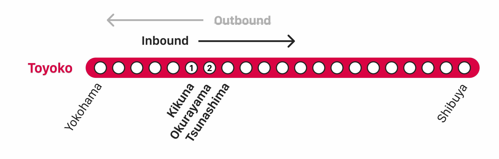

^ Therefore, we know the iPhone is heading inbound to Shibuya.

---


^ We dit it!
^ Our algorithm works well for this case

---

However...

^ but...

---

We must visit 2 stations in order to get a prediction...

^ It could take 5 minutes to determine the train direction.
^ 判定には、場合によっては5分ほどかかります。

---

Can we do better?

^ Can we do better?

---

Use `Location.course`!

^ Let's use the Location's course.

---

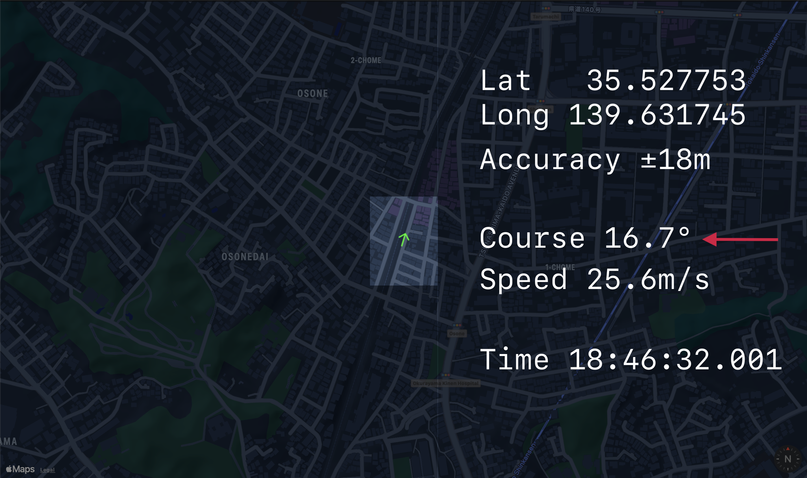

^ Remember that course is included with some CLLocations by Core Location

---


^ Core Location provides an estimate of the iPhone's course in degrees.
^ 0 degrees means North
^ 180 degrees means South

---


^ Note that this is *not* the iPhone's orientation using the compass.

---

# 359.6°


^ The course for the example Location is 359.6 degrees.
^ It's almost directly North.

---

# Direction Algorithm V2


(1) Fetch 2 closest stations to input location

^ First, we find the 2 closest stations to the Location

---

# Direction Algorithm V2


(2) Calculate vector between 2 closest stations for "ascending" direction

^ Next, we calculate the vector between the 2 closest stations for the "ascending" direction in our database.
^ For the Toyoko line, the ascending direction is "outbound".
^ Therefore the vector goes from Tsunashima to Okurayama.

---

# Dot Product

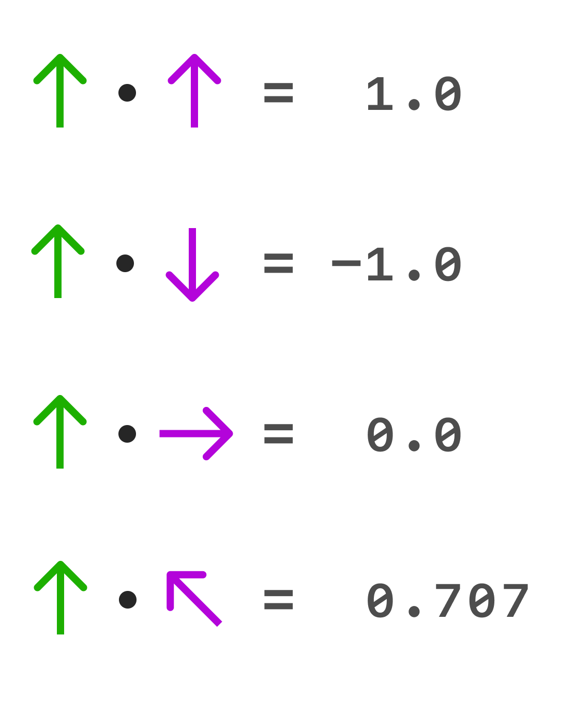

^ Do you remember the dot product from math class?
^ We can compare the direction of unit vectors with the dot product.
^ Two vectors facing the same direction have a positive dot product.
^ Two vectors facing in opposite directions have a negative dot product.

---

# Direction Algorithm V2

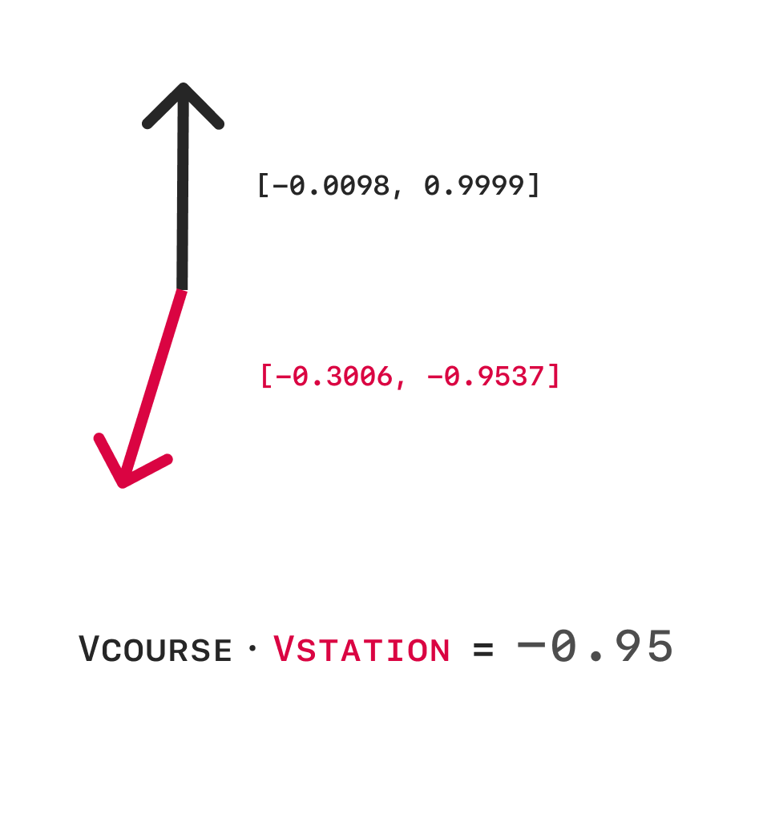

(3) Calculate dot product between location course vector and closest stations vector

^ Next, we calculate the dot product between the Location's course vector and the stations vector.

---

- Positive dot product == "ascending"
- Negative dot product == "descending"

^ If the dot product is positive, then the railway direction is "ascending"
^ If the dot product is negative, then the railway direction is "descending"

---

`-0.95`

^ The dot product is -0.95.

---

`-0.95` ‚Üí negative

^ It's negative.

---

`-0.95` ‚Üí negative ‚Üí "descending"

^ Negative means descending.

---

`-0.95` ‚Üí negative ‚Üí "descending" ‚Üí Inbound 

**to Shibuya**

^ And descending in our database maps to Inbound for the Toyoko Line.
^ Therefore, the iPhone is heading to Shibuya.

---


^ We did it!
^ Our algorithm works well

---

# Let's move on!

^ Let's move on to the last part of the algorithm.

---

1. Determine Railway
2. Determine Railway Direction
3. **Determine Next/Current Station**

^ Finally, we can determine the next station.

---


^ The next station is shown on the train information display

---

- **Next**: Kawasaki

^ The display cycles through next,

---

- ~~**Next**: Kawasaki~~
- **Soon**: Kawasaki

^ soon

---

- ~~**Next**: Kawasaki~~
- ~~**Soon**: Kawasaki~~
- **Now**: Kawasaki

^ and now

---

- ~~**Next**: Kawasaki~~
- ~~**Soon**: Kawasaki~~
- ~~**Now**: Kawasaki~~
- **Next**: Kamata

^ phases for each station.

---


^ On a map, here is where we will show each phase.

---

# Station Algorithm V1

- Calculate **distance** `d` from Location to closest station `S`
- Calculate **direction** vector `c` from Location to `S`

Case|Result
-|-
`d` < 200m|"Now: `S`"
`d` < 500m && `c` > 0|"Soon: `S`"
`c` > 0|"Next: `S`"
else|"Next: `S+1`"

^ We calculate the distance and direction from the location to the closest station.

---


^ When the closest station is in the travel direction, the phase will be "next".

---

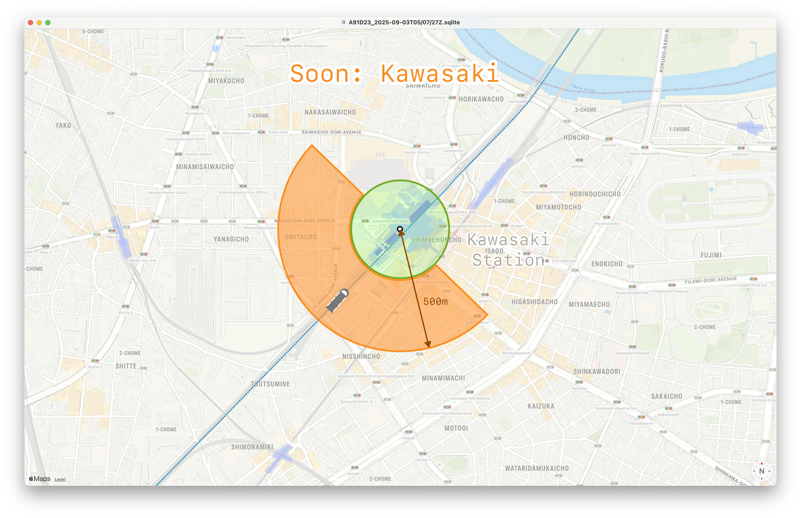

^ A Location less than 500m from the station will be "soon".

---


^ A Location less than 200m from the station will be "now".

---

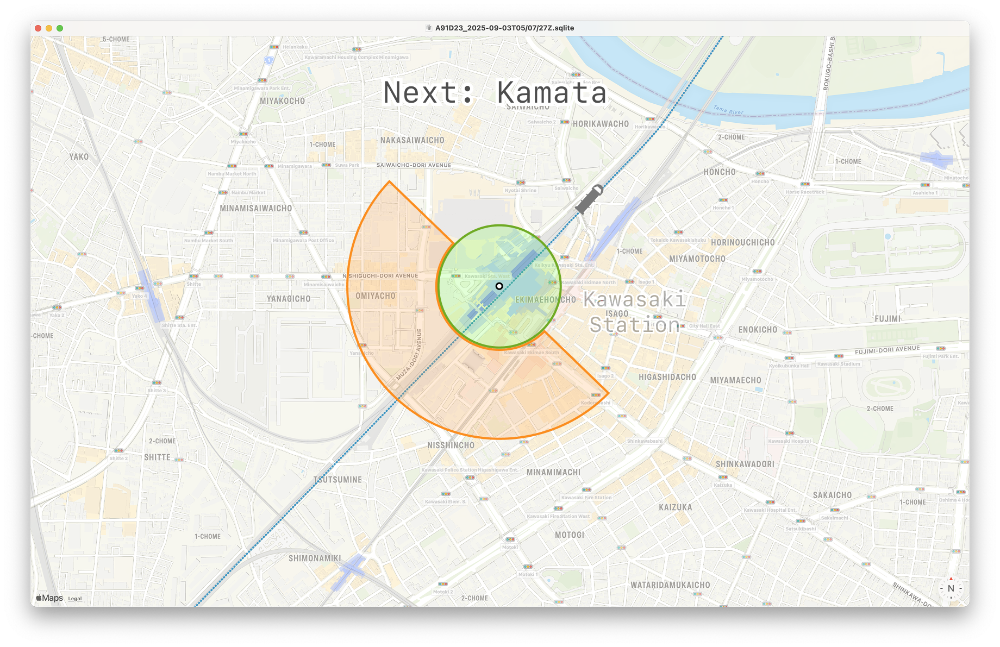

^ Even though the Location is within 500m from the closest station, the station is not in the travel direction.
^ Therefore, the phase will be "next" for the next station in the travel direction.
^ A Location not in the travel direction will be "next" for the next station.

---


^ We did it!
^ Our algorithm works well

---

However...

^ but...

---

## *GPS data is unreliable*


^ GPS data is unreliable.
^ Especially within big stations.
^ Especially when not moving.
^ Here is an example location stopped inside Kawasaki station that has an abysmal 1km accuracy 

---

Let's create a history for each station

^ Let's use history again.

---

```swift
struct StationDirectionalLocationHistory {
	let stationID: Station.ID
	let railDirection: RailDirection

    var visitingLocations: [Location] = []
    var approachingLocations: [Location] = []
    var firstDepartureLocation: Location?
}
```

^ For each station, let's categorize each Location according to its distance and direction.

---


^ In this example, "approaching" points are orange, "visiting" points are green, and the departure point is "red".

---

# Station Algorithm V2

- Step 1: assign locations to stations
- Step 2: update station phase history
- Step 3: select most relevant station phase

^ Station algorithm version 2 has 3 steps.

---

# Step 1: assign locations to stations

- Assign `visitingLocations` or `approachingLocations`


^ In step 1, we categorize a location as "visiting" or "approaching" if it lies within the bounds of a station.

---

# Step 1: assign locations to stations

- Assign `firstDepartureLocation`

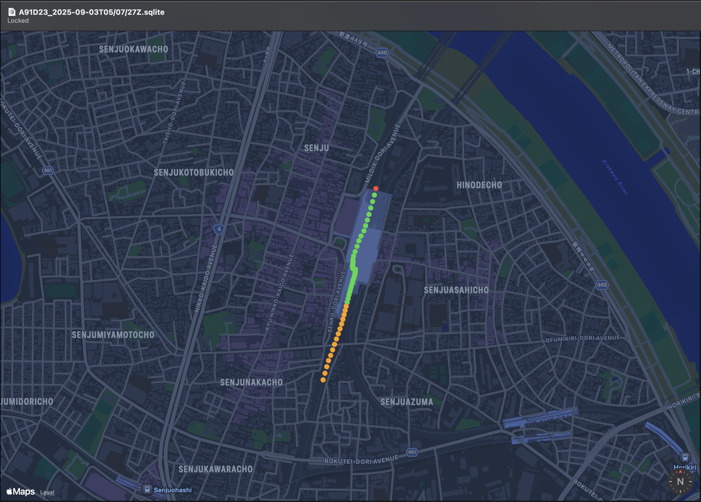

^ If the location is outside the bounds of a station, we set the "firstDepartureLocation".

---

# Step 2: update station phase history

`visiting` | `approach` | `departure` | -> Phase
-|-|-|-
`isEmpty`|`isEmpty`|`!nil`|departure
`isEmpty`|`!isEmpty`|`nil`|approaching
`!isEmpty`|`any`|`nil`|visiting
`!isEmpty`|`any`|`!nil`|visited

^ In step 2, we use the station history to calculate the phase for each station.

---

## *departure*


^ This is a departure phase for Minami-Senju station.
^ The StationDirectionalLocationHistory has only a firstDepartureLocation.

---

## *approaching*

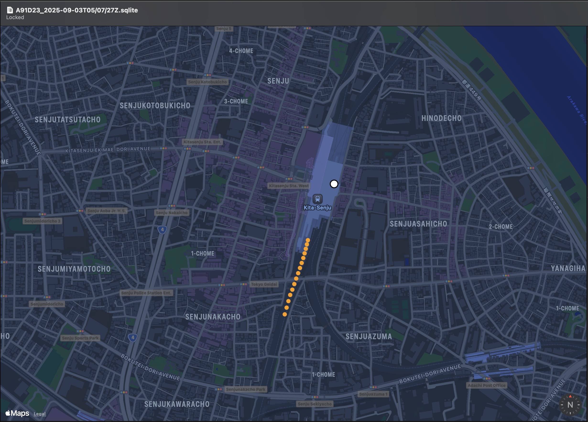

^ This is an approaching phase for Kita-Senju station.

---

## *visiting*


^ This is a visiting phase.

---

## *visited*


^ This is a visited phase.
^ You can see the firstDepartureLocation in red.

---

# Step 3: determine focus phase

- Find last station `S` in travel direction where 
  `phase != nil`

Latest Station Phase|Focus Phase
-|-
departure|`Next`: `S`+1
approaching|`Soon`: `S`
visiting|`Now`: `S`
visited|`Next`: `S`+1

^ In step 3, we look through the phase history for all stations to determine the "focus" phase.

---


^ In an example, when the latest phase for Kawasaki is "Visited", then the focus phase is "Next: Kamata"

---


^ In another example, when the latest phase for Musashi-Kosugi is "Visited" and Motosumiyoshi is "Approaching", then the focus phase is "Soon: Motosumiyoshi"

--- 

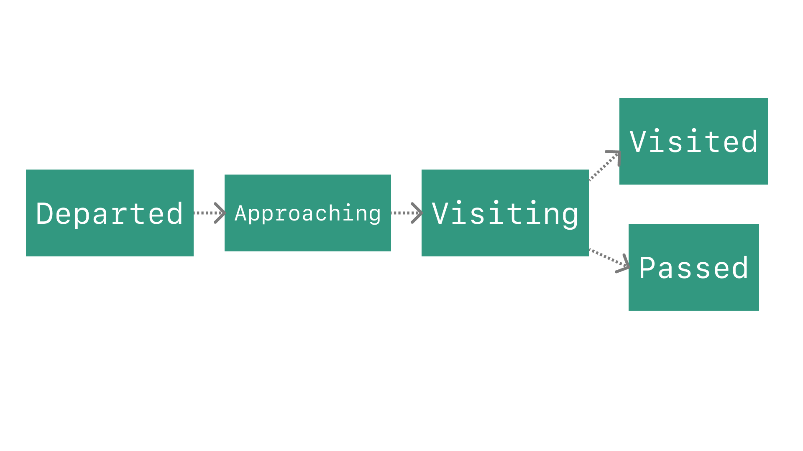

^ Using a state machine gives us more stable results

---


^ We did it!
^ Our algorithm works well...

---

# Bonus

But can we distinguish "visited" and "passed" stations?

^ But can we tell the difference between a visited station and a passed station?
^ We need this information to calculate the railway score.

---

Train is **stopped** within station bounds for more than 20 seconds => `visited`

```swift
let earliestStoppedLocation = visitingLocations.first(where: { $0.speed <= 1.0 })
let latestStoppedLocation = visitingLocations.reversed().first(where: { $0.speed <= 1.0 })
latestStoppedLocation.timestamp.timeIntervalSince(earliestStoppedLocation.timestamp) > 20.0
```

^ If the train is stopped within a station's bounds for more than 20 seconds then it is visited.

---

Train is **moving** within station bounds for more than 70 seconds => `visited`

```swift
let earliestVisitedLocation = stationLocationHistory.visitingLocations.first
firstDepartureLocation.timestamp.timeIntervalSince(earliestVisitedLocation.timestamp) > 70.0
```

^ If the train is moving within a station's bounds for more than 70 seconds then it is visited.
^ This case is for stations with bad GPS reception.

---

Else => `passed`

^ Otherwise we consider the station as passed.

---

# Demo

^ Now I'd like to finish the talk by demoing the SessionViewer macOS app I created.

---


^ I'll show a journey from Kannai station to Kawasaki station on the Keihin-Tohoku Line.
^ ~~start~~
^ It takes some time for all Locations to be processed by the algorithm.
^ I can start playback to see the journey at 10x speed.
^ In the inspector, you can see the algorithm's results updating.
^ Keihin-Tohoku line has the highest score.
^ The direction is northbound.
^ The latest phase for each station is shown.

---


^ When we reach the last Location, we can see the full station history.
^ ~~start~~
^ We can see the phase history too.

---


^ When I click on a station, I can see the Locations used to calculate its phase.

---

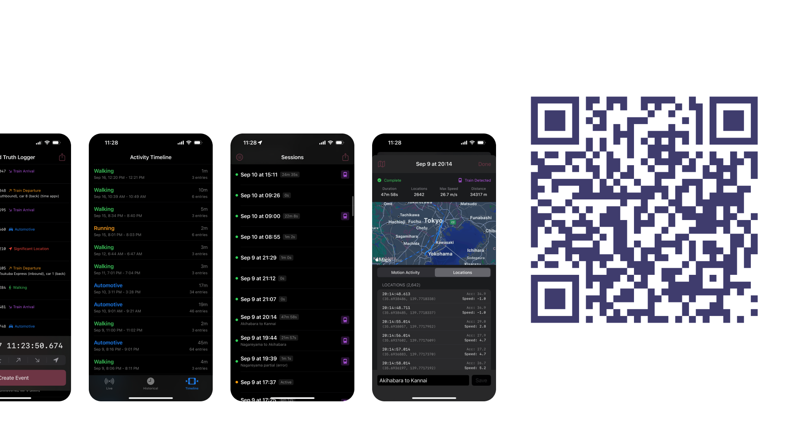

[github.com/twocentstudios/train-tracker-talk](https://github.com/twocentstudios/train-tracker-talk)

^ The 5 apps I used to collect this data are open source on GitHub.
^ This includes the macOS app and the algorithm.

---

# Future Research

- Subway support
	- Custom ML Model for device velocity using accelerometer
	- Add Dead Reckoning to algorithm for temporary GPS failures
	- Stairs counter to detect subway entrance
- Estimate exact train car from timetable
	- Show arrival times
	- Show next stop for express vs. local

^ The algorithm can still be improved.

---

## Try Eki Live!

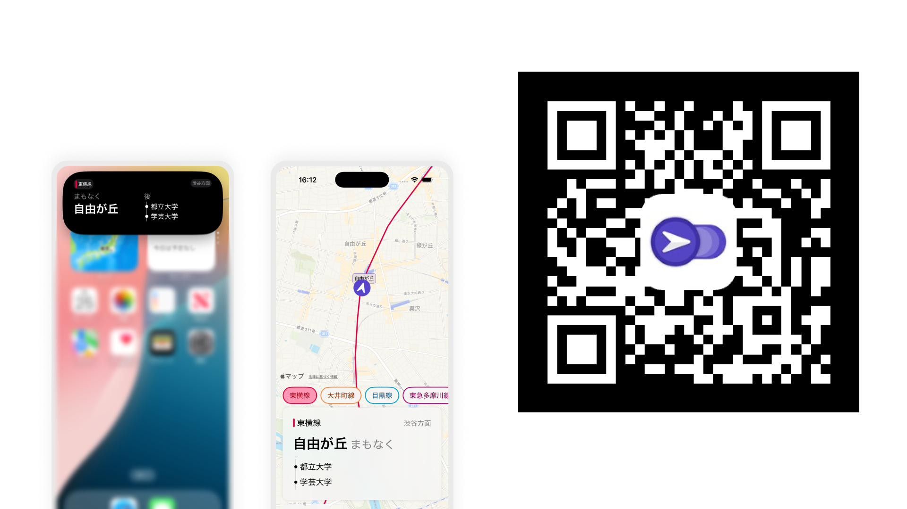

^ But if you want to try it, Eki Live is on the App Store now.
^ The app starts up automatically in the background and shows the next station in the dynamic island.

---

# Thanks


- [twocentstudios.com/blog](https://twocentstudios.com/blog)
- [@twocentstudios](https://twitter.com/twocentstudios)

^ I write regularly on my blog twocentstudios.
^ That's all for today, thanks for watching.
