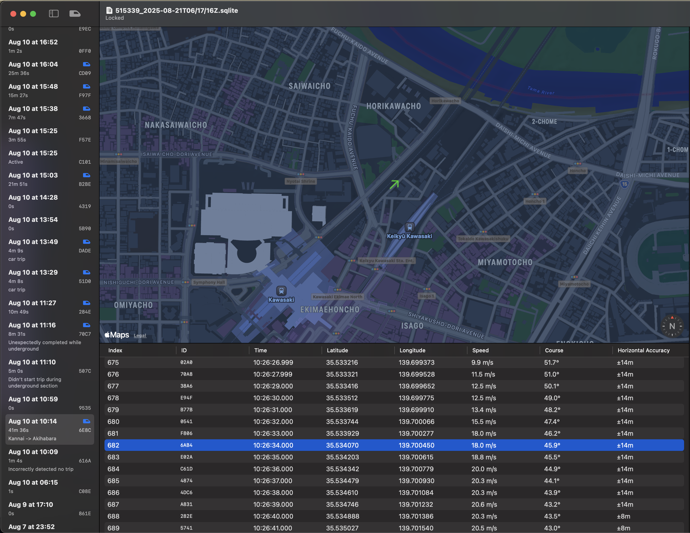

# Let's Write a Train Tracking Algorithm

Chris Trott
*iOSDC 2025/09/20*

^ Hi everyone. Welcome to my talk.
^ みなさん、こんにちは。ようこそ。

---

# Hi, I'm Chris

🇺🇸 *From* Chicago
🇯🇵 *Now* Japan (~8 years)

^ My name is Chris Trott.
^ I'm an iOS Engineer originally from Chicago.
^ But I've lived and worked in Japan for 8 years.
^ クリスといいます。
^ アメリカ人ですけど8年間日本に住んでいます。

---

# Work History

- Timehop (SNS History)
- Cookpad (Cooking)
- twocentstudios (Indie)

^ I worked at a startup called Timehop in New York City.
^ I worked at Cookpad for 6 years.
^ Since then, I've been working on my own apps in the App Store.
^ TODO: app icons
^ ニューヨークにTimehopというSNSのスタートアップで仕事して
^ クックパッドで6年間仕事しました。
^ それ以来、いろいろなアプリを開発して、アプリストアで販売しています。

---

# Let's Write a Train Tracking Algorithm

^ Lately I've been working on an app called Eki Live.
^ Today I'm going to talk about a part of that app.
^ 最近Eki Liveというアプリを開発中です。
^ 今日はEki Liveの一部について話します。

---

# What is a train tracking algorithm?

^ So what do I mean by train tracking algorithm?
^ Well, when riding a train, it's useful to know the upcoming station.
^ 列車移動追跡アルゴリズムはなんという意味でしょうか？
^ 電車に乗る時に、次の駅の情報を知っていることは便利でしょうね。

---


^ On the train, we can see the train information display (案内表示器) or listen for announcements.
^ 電車内では、案内表示器を見たり、車内アナウンスを聞いたりします。

---


^ But would it also be useful to see this information in your Dynamic Island?
^ けど、この情報、ダイナミックアイランドで一目で確認できたら便利ですよね。

---

# **Talk Overview**

1. Review Data Prerequisites
2. Write Algorithm

^ In my talk, we'll first review the data prerequisites we'll need for the algorithm.
^ Then, we'll write each part of the algorithm, improving it step-by-step.
^ 発表では、まずアルゴリズムに必要なデータ要件を整理します。
^ 次に、各パートを実装して、段階的に良くしていきます。

---

# Data Prerequisites

- Static railway data
- Live GPS data from an iPhone on a train

^ We need two types of data for the train tracking algorithm:
^ static railway data and Live GPS data from the iPhone user
^ 列車移動追跡アルゴリズムには、2種類のデータが必要です。
^ 鉄道路線の静的データとiPhoneからのリアルタイムGPSデータ。

---

# Static railway data


- **Railways**
- **Stations**
- Railway Directions
- Railway Coordinates

^ Railways are ordered groups of Stations.
^ In this example, we can see that the Minatomirai Line is made up of 6 stations.
^ 路線は、駅の順序付きリストとして定義します。
^ この例では、みなとみらい線は6駅で構成されています。

---

# Static railway data


- Railways
- Stations
- **Railway Directions**
- **Railway Coordinates**

^ Trains travel in both Directions on a Railway.
^ Coordinates make up the path of a Railway's physical tracks.
^ 路線では、列車は双方向に運行します。
^ 線路の物理的な経路は、座標点の順序付きリストで表せます。

---


^ This map shows the railway data we'll be using.
^ この地図は、今回使う路線データを示しています。

---


^ And a closer look.
^ 少しズームイン。

---

# GPS data


- Sessions table
- Locations table

^ We collect live GPS data from an iPhone using the Core Location framework.
^ We store the data in a local SQLite database.
^ Core Locationを使って、iPhoneからリアルタイムに位置情報を取得します。
^ そのデータは、端末内のSQLiteに保存します。

---

# Location


^ A `Location` has all data from CLLocation.
^ Latitude, longitude, speed, course, accuracy.
^ `Location`は`CLLocation`の情報を一通り含みます。
^ 緯度、経度、速度、進行方位、精度

---

# Session


^ A Session is an ordered list of Locations.
^ A Session represents a possible journey.
^ The green color is for fast and red is for stopped.
^ `Session`は`Location`の時系列リストです。
^* `Session`は可能な移動を表します。
^ 緑は走行中、赤は停止中、という意味です。

---



^ I created a macOS app to visualize the raw data.
^ In the left sidebar there is a list of Sessions.
^ In the top panel there is map.
^ In the bottom panel there is a list of ordered Locations for a Session.
^ Clicking on a Location shows its position and course on the map.
^ 生データの可視化のために、macOSアプリを実装しました。
^ 左側のサイドバーには、Sessionリストです。
^ 上側のパネルには、地図です。
^ 下側のパネルには、選択したSessionのLocationの時系列リストです。
^ Locationを選択すると、地図に位置と進行方位を表示します。

---

# Write Algorithm

1. Determine Railway
2. Determine Direction
3. Determine Next Station

^ Our goal is to make an algorithm that determines 3 types of information:
^ The railway, the direction of the train, and the next or current station.
^ 目的は、3つの情報を推定できるアルゴリズムを作ることです。
^ 鉄道路線、進行方向、次の駅か今いる駅

---


^ Here is a brief overview of the system.
^ これはシステムの全体像です。

---


^ The app channels Location values to the algorithm.
^ アプリは、Core Locationからのocationを順次アルゴリズムに流します。

---


^ The algorithm reads the Location and gathers information from its memory
^ アルゴリズムは`Location`を取り込み、メモリから情報を引き出して組み合わせます。

---


^ The algorithm updates its understanding of the device's location in the world.
^ アルゴリズムは、iPhoneの現在地の推定を更新していきます。

---


^ The algorithm calculates a new result set of railway, direction, and station phase.
^ The result is used to update the app UI and Live Activity.
^ アルゴリズムは、路線、進行方向、駅フェーズの新しい結果を算出します。
^ この結果で、アプリのUIとライブアクティビティを更新します。

---

# Example 1


- Railway: Toyoko Line
- Direction: Inbound (to Shibuya)
- Next station: Tsunashima

^ Let's start by considering a single Location.
^ I captured this Location while riding the Toyoko Line close to Tsunashima Station.
^ 38D9-449-63A0
^ まず、`Location`を一点だけ注目しましょう。
^ 東急東横線に乗っていて、綱島駅の近くでこの`Location`を記録しました。

---

1. **Determine Railway**
2. Determine Railway Direction
3. Determine Next/Current Station

^ Can we determine the Railway from this Location?
^ この`Location`だけで、鉄道路線を推定できますか？

---


^ We have coordinates that outline the railway.
^ 線路の座標点リストがありますね。

---

# Railway Algorithm V1

- Find closest Railway Coordinates to Location
- Sort railways by nearest

^ First, we find the closest RailwayCoordinate to the Location for each Railway.
^ Then, we order the railways by which RailwayCoordinate is nearest.
^ まず、各路線ごとに、この Location に最も近い座標を見つけます。
^ 次に、その距離で、路線を近い順に並べます。

---

Railway|Distance from Location (m)
-|-
Tokyu Toyoko|12.19
Tokyu Shin-Yokohama|177.19
Yokohama Green|1542.94
Tokyu Meguro|2266.07

^ Here are our results.
^ 結果です。

---


^ The closest RailwayCoordinate is the Toyoko Line is only about 12 meters away.
^ The next closest RailwayCoordinate is the Shin-Yokohama Line about 177 meters away.
^ 一番近いのは、東横線の座標で、約12メートルです。
^ 次に近いのは、新横浜線の座標で、約177メートルです。

---


^ Our algorithm works well for this case
^ できたー！
^ （拍手してもいいよ）

---

However...

^ but...
^ けど、、、

---

# Example 2


- Railway: Toyoko Line
- Direction: Outbound (to Yokohama)
- Next station: Hiyoshi

^ Let's consider another Location.
^ This Location was also captured on the Toyoko Line.
^ 8C1B-507-9935
^ では、別の`Location`に注目しましょう。
^ 東横線でもこの`Location`を記録しました。

---

Problem: Toyoko Line and Meguro Line run parallel


^ But in this section of the railway track, the Toyoko Line and Meguro Line run parallel.
^ It's not possible to determine whether the correct line is Toyoko or Meguro from just this one Location.
^ この区間の線路は、東横線と目黒線が並走しています。
^ この一点の`Location`だけでは、路線の特定はできません。

---

We need history


^ The algorithm needs to use all Locations from the journey.
^ The example journey follows the Toyoko Line for longer than the Meguro Line.
^ We can see this at the top.
^ TODO: update graphic for trip from nakameguro
^ アルゴリズムは、行程中の`Location`をすべて使って推定します。
^ この例では、目黒線よりも東横線に沿っている区間のほうが長いです。
^ 上の部分を見てください。

---

# Railway Algorithm V2

- Convert distance to score
- Add scores over time

^ First, we convert the distance between the Location and the nearest railway coordinate to a score
^ The score is high if close and exponentially lower when far.
^ Then, we add the scores over time.
^ まず、この`Location`と一番近い線路座標の距離をスコアに変えます。
^ 近いほどスコアは高く、離れるほど指数的に下がります。
^ そのスコアを時間方向に足し合わせていきます。

---

## Railway Algorithm V2


^ The score from Nakameguro to Hiyoshi is now higher for the Toyoko Line than the Meguro Line.
^ 中目黒・日吉の区間では、東横線の累積スコアのほうが目黒線よりも高くなっています。

---


^ Our algorithm works well for this case
^ できたー

---

However...

^ but...
^ けど。。。

---

# Example 3


- Railway: Keihin-Tohoku Line
- Direction: Northbound
- Next station: Kamata

^ Let's consider a third Location.
^ This Location was captured on the Keihin-Tohoku Line which runs the east corridor of Tokyo.
^ 6E8C-785-41BB
^ では、三つ目の`Location`に注目しましょう。
^ この`Location`は、東京の東側の幹線である京浜東北線の車内で記録しました。

---


^ Several lines run parallel in this corridor.
^ The Tokaido Line follows the same track as the Keihin-Tohoku Line
^ この区間では、複数の路線が並行しています。
^ 東海道線は、京浜東北線と同じ並びで並行しています。

---


^ But the Tokaido Line skips many stations.
^ ただ、東海道線は多くの駅を通過します。

---


^ If we only compare railway coordinate proximity scores, the scores will be the same.
^ 距離スコアだけで比べると、スコアは同じになります。

---

# Railway Algorithm V3

- Add penalty for passed stations
- Add penalty for stopping between stations

^ Let's add a small penalty to the score if a station is passed.
^ If a station is passed, that indicates the iPhone may be on a parallel express railway.
^ Let's also add a small penalty to the score if a train stops between stations.
^ If a train stops between stations, that indicates the iPhone may be on a parallel local railway.
^ 駅を通過したら、スコアを少し減点しましょう。
^ 駅間で止まったときも、少し減点します。

---


^ Using this algorithm, the Keihin-Tohoku score is now slightly larger than the Tokaido score.
^ このアルゴリズムでは、京浜東北線のスコアが東海道線をわずかに高いです。

---


^ Let's consider two example trips to better understand penalties
^ For an example trip 1 that starts at Tokyo...
^ ペナルティの影響を確認するため、2つの行程例を見ていきましょう。
^ まず、ケース1、東京駅スタートです。

---


^ The train stops at the 2nd Keihin-Tohoku station.
^ The Tokaido score receives a penalty since the stop occurs between stations.
^ 電車は京浜東北線の2駅目に止まります。
^ 東海道線のほうは駅間での停止になるので、スコアを減点します。

---


^ As we continue...
^ 続いていって、

---


^ The Tokaido score receives many penalties.
^ The algorithm determines the trip was on the Keihin-Tohoku Line.
^ 東海道線側はペナルティが重なります。
^ アルゴリズムは「京浜東北線」と判断します。

---


^ For an example trip 2 that starts at Tokyo...
^ ケース2、また東京駅スタートです。

---


^ The train passes the 2nd Keihin-Tohoku station.
^ And the Keihin-Tohoku score receives a penalty.
^ 電車は京浜東北線の2駅目を通過します。
^ なので、京浜東北線側はスコアを減点します。

---


^ As we continue...
^ 続いていって、

---


^ The Keihin-Tohoku score receives many penalties.
^ The algorithm determines the trip was on the Tokaido Line.
^ 京浜東北側はペナルティが重なります。
^ アルゴリズムは「東海道線」と判断します。

---


^ Our algorithm works well for this case
^ できた！

---

There are many more edge cases but...

^ There are many more edge cases.
^ まだまだコーナーケースも多いですが

---

# Let's move on!

^ However, let's continue.
^ 先に進みましょう。

---

1. Determine Railway
2. **Determine Railway Direction**
3. Determine Next/Current Station

^ For each potential railway, we will determine which direction the train is moving.

---

Every Railway has **2 directions**

^ Every railway has 2 directions.

---


^ We're used to seeing separate timetables on the departure board.

---


^ For example, the Toyoko Line goes inbound towards Shibuya and outbound towards Yokohama.

---

# Example


- Railway: Toyoko Line
- Direction: Inbound (to Shibuya)
- Next station: Tsunashima

^ Let's consider a Location captured on the Toyoko Line going inbound to Shibuya.
^ 38D9-449-63A0

---

# Direction Algorithm V1

- Mark timestamp for 2 stations
- Compare order of first and second station

^ Once we have visited two stations, we can compare the temporal order the station visits.
^ If the visit order matches the order of the stations in the database, the iPhone is heading in the "ascending" direction.

---


^ The iPhone visited Kikuna and then Okurayama.

---


^ Therefore, we know the iPhone is heading inbound to Shibuya.

---


^ Our algorithm works well for this case

---

However...

^ but...

---

We must visit 2 stations in order to get a prediction...

^ It could take 5 minutes to determine the train direction.

---

Can we do better?

^ Can we do better?

---

Use `Location.course`!

^ Let's use the Location's course.

---


^ Remember that course is included with some CLLocations by Core Location

---


^ Core Location provides an estimate of the iPhone's course in degrees.
^ 0 degrees means North
^ 180 degrees means South

---


^ Note that this is *not* the iPhone's orientation using the compass.

---


^ The course for the example Location is 359.6 degrees.
^ It's almost directly North.

---

# Direction Algorithm V2


(1) Fetch 2 closest stations to input location

^ First, we find the 2 closest stations to the Location

---

# Direction Algorithm V2


(2) Calculate vector between 2 closest stations for "ascending" direction

^ Next, we calculate the vector between the 2 closest stations for the "ascending" direction in our database.
^ For the Toyoko line, the ascending direction is "outbound".
^ Therefore the vector goes from Tsunashima to Okurayama.

---

# Dot Product


^ We can compare the direction of unit vectors with the dot product.
^ Two vectors facing the same direction have a positive dot product.
^ Two vectors facing in opposite directions have a negative dot product.

---

# Direction Algorithm V2


(3) Calculate dot product between location course vector and closest stations vector

^ Next, we calculate the dot product between the Location's course vector and the stations vector.
^ SIMD2<Double>(-0.009881526051794902, 0.9999511765295782) SIMD2<Double>(-0.30066170507757767, -0.9537308525469036) -0.9507132916253328  --- course, stations, dot

---

- Positive dot product == "ascending"
- Negative dot product == "descending"

^ If the dot product is positive, then the railway direction is "ascending"
^ If the dot product is negative, then the railway direction is "descending"

---

`-0.95`

^ The dot product is -0.95.

---

`-0.95` → negative

^ It's negative.

---

`-0.95` → negative → "descending"

^ Negative means descending.

---

`-0.95` → negative → "descending" → Inbound 

**to Shibuya**

^ And descending in our database maps to Inbound for the Toyoko Line.
^ Therefore, the iPhone is heading to Shibuya.

---


^ Our algorithm works well

---

# Let's move on!

^ Let's move on to the last part of the algorithm.

---

1. Determine Railway
2. Determine Railway Direction
3. **Determine Next/Current Station**

^ Finally, we can determine the next station.

---


^ The next station is shown on the train information display (案内表示器)

---

- **Next**: Kawasaki

^ The display cycles through next, soon, and now phases for each station.

---

- ~~**Next**: Kawasaki~~
- **Soon**: Kawasaki

---

- ~~**Next**: Kawasaki~~
- ~~**Soon**: Kawasaki~~
- **Now**: Kawasaki

---

- ~~**Next**: Kawasaki~~
- ~~**Soon**: Kawasaki~~
- ~~**Now**: Kawasaki~~
- **Next**: Kamata

---


^ On a map, here is where we will show each phase.

---

# Station Algorithm V1

- Calculate **distance** `d` from Location to closest station `S`
- Calculate **direction** `c` from Location to closest station `S`

Case|Result
-|-
`d` < 200m|"Now: `S`"
`d` < 500m && `c` > 0|"Soon: `S`"
`c` > 0|"Next: `S`"
else|"Next: `S+1`"

^ We calculate the distance and direction from the location to the closest station.

---


^ A Location in the travel direction will be "next".

---


^ A Location less than 500m from the station in the travel direction will be "soon".

---


^ A Location less than 200m from the station will be "now".

---


^ A Location not in the travel direction will be "next" for the next station.

---


^ Our algorithm works well

---

However...

^ but...

---

GPS data is **unreliable**

^ GPS data is unreliable.
^ Especially within big stations.
^ Especially when not moving.

---


^ Here is an example location stopped inside Kawasaki station that has an abysmal 1km accuracy 

---

Let's create a history for each station

^ Let's use history again.

---

```swift
struct StationDirectionalLocationHistory {
	let stationID: Station.ID
	let railDirection: RailDirection

    var visitingLocations: [Location] = []
    var approachingLocations: [Location] = []
    var firstDepartureLocation: Location?
}
```

^ For each station, let's categorize each Location according to its distance and direction.

---


^ In this example, "approaching" points are orange, "visiting" points are green, and the departure point is "red".

---

# Station Algorithm V2

- Step 1: assign locations to stations
- Step 2: update station phase history
- Step 3: select most relevant station phase

^ Station algorithm version 2 has 3 steps.

---

# Step 1: assign locations to stations

- Assign `visitingLocations` or `approachingLocations`


^ In step 1, we categorize a location as "visiting" or "approaching" if it lies within the bounds of a station.

---

# Step 1: assign locations to stations

- Assign `firstDepartureLocation`


^ If the location is outside the bounds of a station, we set the firstDepartureLocation.

---

# Step 2: update station phase history

`visiting` | `approach` | `departure` | -> Phase
-|-|-|-
`isEmpty`|`isEmpty`|`!nil`|departure
`isEmpty`|`!isEmpty`|`nil`|approaching
`!isEmpty`|`any`|`nil`|visiting
`!isEmpty`|`any`|`!nil`|visited

^ In step 2, we use the station history to calculate the phase for each station.

---


^ This is a departure phase for Minami-Senju station.
^ The StationDirectionalLocationHistory has only a firstDepartureLocation.

---


^ This is an approaching phase for Kita-Senju station.

---


^ This is a visiting phase.

---


^ This is a visited phase.
^ You can see the firstDepartureLocation in red.

---

# Step 3: select most relevant station phase

- Find last station `S` in travel direction where `phase != nil`

Station Phase|Result
-|-
departure|Next: `S`+1
approaching|Approaching: `S`
visiting|Visiting: `S`
visited|Next: `S`+1

^ In step 3, we look through the phase history for all stations to determine the "focus" phase.

---


^ In an example, when the latest phase for Kawasaki is "Visited", then the focus phase is "Next: Kamata"

---


^ In another example, when the latest phase for Musashi-Kosugi is "Visited" and Motosumiyoshi is "Approaching", then the focus phase is "Soon: Motosumiyoshi"

--- 


^ Using a state machine gives us more stable results

---


^ Our algorithm works well...

---

# Bonus

But can we distinguish "visited" and "passed" stations?

^ But can we tell the difference between a visited station and a passed station?
^ We need this information to calculate the railway score.

---

Train is **stopped** within station bounds for more than 20 seconds => `visited`

```swift
let earliestStoppedLocation = visitingLocations.first(where: { $0.speed <= 1.0 })
let latestStoppedLocation = visitingLocations.reversed().first(where: { $0.speed <= 1.0 })
latestStoppedLocation.timestamp.timeIntervalSince(earliestStoppedLocation.timestamp) > 20.0
```

^ If the train is stopped within a station's bounds for more than 20 seconds then it is visited.

---

Train is **moving** within station bounds for more than 70 seconds => `visited`

```swift
let earliestVisitedLocation = stationLocationHistory.visitingLocations.first
firstDepartureLocation.timestamp.timeIntervalSince(earliestVisitedLocation.timestamp) > 70.0
```

^ If the train is moving within a station's bounds for more than 70 seconds then it is visited.
^ This case is for stations with bad GPS reception.

---

Else => `passed`

^ Otherwise we consider the station as passed.

---


^ Our algorithm works well for these cases.

---

# Demo

^ Now I'd like to finish the talk by demoing the SessionViewer macOS app I created.
^ I'll show a journey from Kannai station to Kawasaki station on the Keihin-Tohoku Line.
^ It takes some time for all Locations to be processed by the algorithm.
^ I can start playback to see the journey at 10x speed.
^ In the right sidebar, you can see the algorithm's results updating.
^ Keihin-Tohoku line has the highest score.
^ The direction is northbound.
^ The latest phase for each station is shown.
^ We can see the phase history too.
^ When I click on a station, I can see the Locations used to calculate its phase.
^ When I click on the last Location, we can see the full station history.

---


github.com/twocentstudios/train-tracker-talk

^ The apps I used to collect this data are open source on github.
^ TODO: screenshots of all apps

---

# Future Research

- Subway support
	- Custom ML Model for device velocity using accelerometer
	- Stairs counter to detect subway entrance
- Estimate exact train car from timetable
	- Show arrival times
	- Show next stop for express vs. local

^ The algorithm can still be improved.

---

# Full version


- Eki Live on the App Store

^ But if you want to try it, Eki Live is on the App Store now.
^ The app starts up automatically in the background and shows the next station in the dynamic island.

---

# Hire Me


- Full-time or contract
- iOS generalist (not just train apps)
- twocentstudios.com

^ I'm available for full-time or contract work.
^ I write regularly on my blog twocentstudios.
^ That's all for today.
