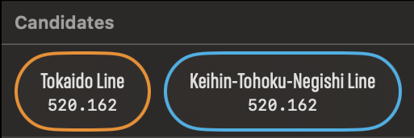
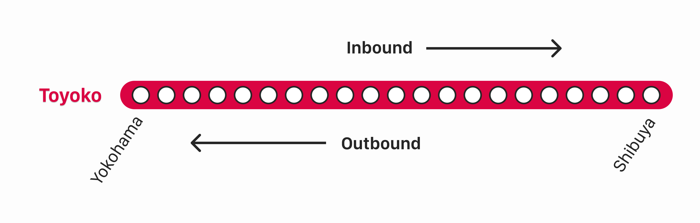
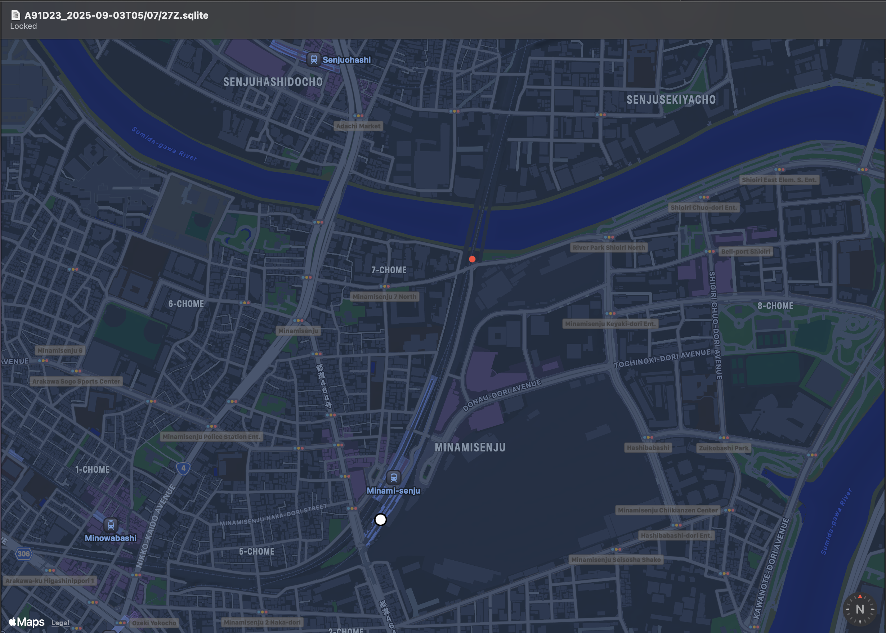
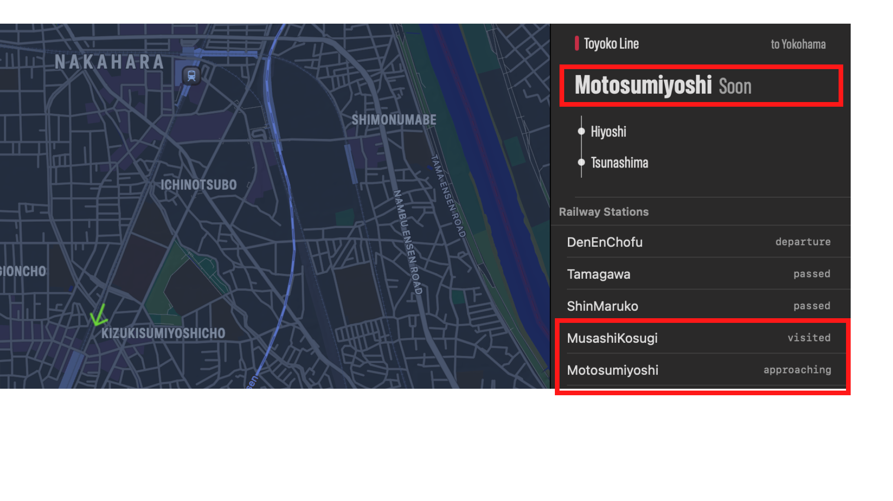

---

# Let's Write a Train Tracking Algorithm

Chris Trott
*iOSDC 2025/09/20*

^ Hi everyone. Welcome to my talk.
^ みなさん、こんにちは。Track D、ようこそ。

---

# Hi, I'm Chris

🇺🇸 *From* Chicago
🇯🇵 *Now* Japan (~8 years)

^ My name is Chris Trott.
^ I'm an iOS Engineer originally from Chicago.
^ But I've lived and worked in Japan for 8 years.
^ クリスといいます。よろしくお願いします。
^ アメリカ人ですけど8年間日本に住んでいます。

---


^ I worked at a startup called Timehop in New York City.
^ I worked at Cookpad for 6 years.
^ Since then, I've been working on my own apps in the App Store.
^ ニューヨークで Timehop という SNS スタートアップで働きました。
^ クックパッドで6年間働きました。
^ それ以来、個人でいろいろなアプリを作って、App Store で販売しています。

---

# Let's Write a Train Tracking Algorithm

^ Lately I've been working on an app called Eki Live.
^ Today I'm going to talk about a part of that app.
^ 最近Eki Liveというアプリを開発中です。
^ 今日はEki Liveの一部について話します。

---

# What is a train tracking algorithm?

^ So what do I mean by train tracking algorithm?
^ Well, when riding a train, it's useful to know the upcoming station.
^ 「列車ルート追跡アルゴリズム」とは何でしょうか？
^ 電車に乗るとき、次の駅がわかると便利ですよね。

---


^ On the train, we can see the train information display (案内表示器) or listen for announcements.
^ 電車内では、案内表示器を見たり、車内アナウンスを聞いたりします。

---


^ But would it also be useful to see this information in your Dynamic Island?
^ でも、この情報がダイナミックアイランドに出たらもっと便利ですよね。

---

# **Talk Overview**

1. Review Data Prerequisites
2. Write Algorithm

^ In my talk, we'll first review the data prerequisites we'll need for the algorithm.
^ Then, we'll write each part of the algorithm, improving it step-by-step.
^ 発表では、まずアルゴリズムに必要なデータを整理します。
^ 次に、各パートを実装して、段階的に良くしていきます。

---

# Data Prerequisites

- Static railway data
- Live GPS data from an iPhone on a train

^ We need two types of data for the train tracking algorithm:
^ static railway data and Live GPS data from the iPhone user
^ アルゴリズムには、2種類のデータが必要です。
^ 路線の静的データと、リアルタイム GPS データです。

---

# Static railway data


- **Railways**
- **Stations**
- Railway Directions
- Railway Coordinates

^ Railways are ordered groups of Stations.
^ In this example, we can see that the Minatomirai Line is made up of 6 stations.
^ 路線は、駅の順序付きリストとして定義します。
^ この例では、みなとみらい線は6駅で構成されています。

---

# Static railway data


- Railways
- Stations
- **Railway Directions**
- **Railway Coordinates**

^ Trains travel in both Directions on a Railway.
^ Coordinates make up the path of a Railway's physical tracks.
^ 路線では、列車は双方向に運行します。
^ 線路の物理的なルートは、座標点の並びで表せます。

---


^ This map shows the railway data we'll be using.
^ この地図は、今回使う路線データを示しています。

---

# GPS data


- Local SQLite Database
- `sessions` & `locations` tables

^ We collect live GPS data from an iPhone using the Core Location framework.
^ We store the data in a local SQLite database.
^ Core Location を使って、iPhone からリアルタイムに位置情報を取得します。
^ そのデータは、端末内の SQLite に保存します。

---

# Location


^ A `Location` has all data from CLLocation.
^ Latitude, longitude, speed, course, accuracy.
^ `Location`は`CLLocation`の情報を一通り含みます。
^ 緯度、経度、速度、進行方位、精度などです。

---

# *Session*


^ A Session is an ordered list of Locations.
^ A Session represents a possible journey.
^ The green color is for fast and red is for stopped.
^ `Session`は`Location`の時系列リストです。
^ `Session`は可能なルートを表します。

---


^ I created a macOS app to visualize the raw data.
^ 生データの可視化のために、macOS アプリを作りました。

---


^ In the left sidebar there is a list of Sessions.
^ サイドバーには、Session のリストがあります。

---


^ In the bottom panel there is a list of ordered Locations for a Session.
^ Clicking on a Location shows its position and course on the map.
^ 下側のパネルには、選択した Session の Location の時系列リストがあります。

---

# Write Algorithm

1. Determine Railway
2. Determine Direction
3. Determine Next Station

^ Our goal is to make an algorithm that determines 3 types of information:
^ The railway, the direction of the train, and the next or current station.
^ 目的は、3つの情報を推定できるアルゴリズムを作ることです。
^ 路線、進行方向、次の駅です。

---


^ Here is a brief overview of the system.
^ これはシステムの全体像です。

---


^ The app channels Location values to the algorithm.
^ アプリは、Core Location からの `Location` をアルゴリズムに順次流します。

---


^ The algorithm reads the Location and gathers information from its memory
^ ~~アルゴリズムは `Location` を取り込み、メモリから情報を引き出して組み合わせます。~~

---


^ The algorithm updates its understanding of the device's location in the world.
^ ~~アルゴリズムは、iPhoneの現在地の推定を更新していきます。~~

---


^ The algorithm calculates a new result set of railway, direction, and station phase.
^ The result is used to update the app UI and Live Activity.
^ アルゴリズムは、新しい結果を算出します。
^ この結果で、アプリの UI と Live Activity を更新します。

---

# Example 1


- Railway: Toyoko Line
- Direction: Inbound (to Shibuya)
- Next station: Tsunashima

^ Let's start by considering a single Location.
^ I captured this Location while riding the Toyoko Line close to Tsunashima Station.
^ 38D9-449-63A0
^ まず、`Location`を一点だけ注目しましょう。
^ 東横線に乗っていて、綱島駅の近くでこの`Location`を記録しました。

---

1. **Determine Railway**
2. Determine Railway Direction
3. Determine Next/Current Station

^ Can we determine the Railway from this Location?
^ この`Location`だけで、路線を推定できますか？

---


^ We have coordinates that outline the railway.
^ 線路の座標点リストがありますね。

---

# Railway Algorithm V1

- Find closest Railway Coordinates to Location
- Sort railways by nearest

^ First, we find the closest RailwayCoordinate to the Location for each Railway.
^ Then, we order the railways by which RailwayCoordinate is nearest.
^ 各路線ごとに、この `Location` に最も近い線路座標を見つけて、
^ 距離順に並べます。

---

Railway|Distance from Location (m)
-|-
Tokyu Toyoko|12.19
Tokyu Shin-Yokohama|177.19
Yokohama Green|1542.94
Tokyu Meguro|2266.07

^ Here are our results.
^ 結果です。

---


^ The closest RailwayCoordinate is the Toyoko Line is only about 12 meters away.
^ The next closest RailwayCoordinate is the Shin-Yokohama Line about 177 meters away.
^ 一番近いのは、東横線の座標で、約12メートルです。
^ ~~次に近いのは、新横浜線の座標で、約177メートルです。~~

---


^ Our algorithm works well for this case
^ できたー！
^ （拍手してもいいよ）

---

However...

^ but...
^ でも…

---

# Example 2


- Railway: Toyoko Line
- Direction: Outbound (to Yokohama)
- Next station: Hiyoshi

^ Let's consider another Location.
^ This Location was also captured on the Toyoko Line.
^ 8C1B-507-9935
^ 東横線での別の `Location` に注目しましょう。

---

Problem: Toyoko Line and Meguro Line run parallel


^ But in this section of the railway track, the Toyoko Line and Meguro Line run parallel.
^ It's not possible to determine whether the correct line is Toyoko or Meguro from just this one Location.
^ この区間では、東横線と目黒線の線路が並行しています。
^ この一点の `Location` だけでは、路線の特定はできません。

---

We need **history**


^ The algorithm needs to use all Locations from the journey.
^ The example journey follows the Toyoko Line for longer than the Meguro Line.
^ We can see this at the top.
^ アルゴリズムは、ルートの `Location` をすべて使って推定します。
^ この例では、目黒線よりも東横線に沿っている区間のほうが長いです。

---

# Railway Algorithm V2

- Convert distance to score
- Add scores over time

^ First, we convert the distance between the Location and the nearest railway coordinate to a score
^ The score is high if close and exponentially lower when far.
^ Then, we add the scores over time.
^ まず、この`Location`と一番近い線路座標の距離をスコアに変えます。
^ 近いほどスコアは高く、離れるほど指数的に下がります。
^ そのスコアを時間方向に足し合わせていきます。

---

## Railway Algorithm V2


^ The score from Nakameguro to Hiyoshi is now higher for the Toyoko Line than the Meguro Line.
^ 東横線の累積スコアのほうが目黒線よりも高くなっています。

---


^ Our algorithm works well for this case
^ できたー

---

However...

^ but...
^ けど。。。

---

# Example 3


- Railway: Keihin-Tohoku Line
- Direction: Northbound
- Next station: Kamata

^ Let's consider a third Location.
^ This Location was captured on the Keihin-Tohoku Line which runs the east corridor of Tokyo.
^ 6E8C-785-41BB
^ 3つ目の`Location`に注目しましょう。
^ 東京の東側の幹線である京浜東北線の車内で記録しました。

---


^ Several lines run parallel in this corridor.
^ The Tokaido Line follows the same track as the Keihin-Tohoku Line
^ 東海道線は、京浜東北線と並行して走っています。

---


^ But the Tokaido Line skips many stations.
^ ただ、東海道線は多くの駅を通過します。

---



^ If we only compare railway coordinate proximity scores, the scores will be the same.
^ 距離スコアだけで比べると、スコアは同じになります。

---

# Railway Algorithm V3

- Add penalty for passed stations
- Add penalty for stopping between stations

^ Let's add a small penalty to the score if a station is passed.
^ If a station is passed, that indicates the iPhone may be on a parallel express railway.
^ Let's also add a small penalty to the score if a train stops between stations.
^ If a train stops between stations, that indicates the iPhone may be on a parallel local railway.
^ 駅を通過したら、スコアを少し減点しましょう。
^ 駅間で止まったときも、少し減点します。

---


^ Using this algorithm, the Keihin-Tohoku score is now slightly larger than the Tokaido score.
^ 京浜東北線のスコアがわずかに高いです。

---


^ Let's consider two example trips to better understand penalties
^ For an example trip 1 that starts at Tokyo...
^ ペナルティの影響を確認するため、2つのルートの例を見ていきましょう。
^ まず、ケース1、東京駅スタートです。

---


^ The train stops at the 2nd Keihin-Tohoku station.
^ The Tokaido score receives a penalty since the stop occurs between stations.
^ 電車は京浜東北線の2駅目に止まります。
^ 東海道線のほうは駅間での停止になるので、スコアを減点します。

---


^ As we continue...
^ 続いていって、

---


^ The Tokaido score receives many penalties.
^ The algorithm determines the trip was on the Keihin-Tohoku Line.
^ 東海道線側はペナルティが重なります。
^ アルゴリズムは「京浜東北線」と判断します。

---


^ For an example trip 2 that starts at Tokyo...
^ ケース2、

---


^ The train passes the 2nd Keihin-Tohoku station.
^ And the Keihin-Tohoku score receives a penalty.
^ 電車は京浜東北線の2駅目を通過します。
^ なので、京浜東北線側はスコアを減点します。

---


^ As we continue...
^ 続いていって、

---


^ The Keihin-Tohoku score receives many penalties.
^ The algorithm determines the trip was on the Tokaido Line.
^ 京浜東北線側はペナルティが重なります。
^ 「東海道線」と判断します。

---


^ Our algorithm works well for this case
^ できた！

---

There are many more edge cases but...

^ There are many more edge cases.
^ まだまだコーナーケースも多いですが

---

# Let's move on!

^ However, let's continue.
^ 先に進みましょう。

---

1. Determine Railway
2. **Determine Railway Direction**
3. Determine Next/Current Station

^ For each potential railway, we will determine which direction the train is moving.
^ 候補の路線ごとに、列車の進行方向を推定します。

---

Every Railway has **2 directions**

^ Every railway has 2 directions.
^ どの路線も、方向は2つです。


---


^ We're used to seeing separate timetables on the departure board.
^ 駅の発車案内は、上りと下りで別々ですよね。

---



^ For example, the Toyoko Line goes inbound towards Shibuya and outbound towards Yokohama.
^ 東横線では、渋谷方面が上り、横浜方面が下りです。

---

# Example


- Railway: Toyoko Line
- Direction: Inbound (to Shibuya)
- Next station: Tsunashima

^ Let's consider a Location captured on the Toyoko Line going inbound to Shibuya.
^ 38D9-449-63A0
^ 東横線の渋谷方面で記録した`Location`に注目しましょう。

---

# Direction Algorithm V1

- Mark timestamp for 2 stations
- Compare order of 1st and 2nd station

^ Once we have visited two stations, we can compare the temporal order the station visits.
^ If the visit order matches the order of the stations in the database, the iPhone is heading in the "ascending" direction.
^ 2駅に停車した時点で、停車の時系列を比べます。
^ データベース上の駅の並びと一致すれば、進行方向は"ascending"と判定します。

---


^ The iPhone visited Kikuna and then Okurayama.
^ 菊名に停車して、そのあと大倉山に停車しました。

---


^ Therefore, we know the iPhone is heading inbound to Shibuya.
^ つまり、渋谷方面です。

---


^ Our algorithm works well for this case
^ できた！

---

However...

^ but...
^ けど、、、

---

We must visit 2 stations in order to get a prediction...

^ It could take 5 minutes to determine the train direction.
^ 判定には、場合によっては5分ほどかかります。

---

Can we do better?

^ Can we do better?
^ では、もっと良くできるでしょうか？

---

Use `Location.course`!

^ Let's use the Location's course.
^ `Location`の進行方位も使いましょう！

---


^ Remember that course is included with some CLLocations by Core Location
^ Core Location は、iPhone の進行方位を度数で返してくれます。

---


^ Core Location provides an estimate of the iPhone's course in degrees.
^ 0 degrees means North
^ 180 degrees means South
^ 0度が北、180度が南です。

---


^ Note that this is *not* the iPhone's orientation using the compass.
^ 注意点ですが、コンパスの方位は使っていません。

---

# 359.6°


^ The course for the example Location is 359.6 degrees.
^ It's almost directly North.
^ 例の`Location`の進行方位は359.6度です。
^ ほぼ北向きです。

---

# Direction Algorithm V2


(1) Fetch 2 closest stations to input location

^ First, we find the 2 closest stations to the Location
^ まず、この`Location`から最寄り駅を2つ見つけます。

---

# Direction Algorithm V2


(2) Calculate vector between 2 closest stations for "ascending" direction

^ Next, we calculate the vector between the 2 closest stations for the "ascending" direction in our database.
^ For the Toyoko line, the ascending direction is "outbound".
^ Therefore the vector goes from Tsunashima to Okurayama.
^ 次に、データベースの"ascending"に合わせて、2駅間の方向ベクトルを出します。
^ 東横線では、"ascending"の方向は下りです。
^ なので、ベクトルは綱島から大倉山への向きになります。

---

# Dot Product


^ Do you remember the dot product from math class?
^ We can compare the direction of unit vectors with the dot product.
^ Two vectors facing the same direction have a positive dot product.
^ Two vectors facing in opposite directions have a negative dot product.
^ 内積、覚えていますか？
^ 単位ベクトルの向きは内積で比べられます。
^ 同じ向き、正。
^ 逆向き、負。

---

# Direction Algorithm V2


(3) Calculate dot product between location course vector and closest stations vector

^ Next, we calculate the dot product between the Location's course vector and the stations vector.
^ 次に、内積を取ります。

---

- Positive dot product == "ascending"
- Negative dot product == "descending"

^ If the dot product is positive, then the railway direction is "ascending"
^ If the dot product is negative, then the railway direction is "descending"
^ 内積が正なら、進行方向は"ascending"です。
^ 負なら"descending"です。

---

`-0.95`

^ The dot product is -0.95.
^ 計算した内積は-0.95です。

---

`-0.95` → negative

^ It's negative.
^ 負です。

---

`-0.95` → negative → "descending"

^ Negative means descending.
^ 負は"descending"とします。

---

`-0.95` → negative → "descending" → Inbound 

**to Shibuya**

^ And descending in our database maps to Inbound for the Toyoko Line.
^ Therefore, the iPhone is heading to Shibuya.
^ データベースでは、"descending"は東横線の上りに対応します。
^ なので、渋谷方面に向かっています。

---


^ Our algorithm works well
^ できた！

---

# Let's move on!

^ Let's move on to the last part of the algorithm.
^ アルゴリズムの最後のパートに入りましょう。

---

1. Determine Railway
2. Determine Railway Direction
3. **Determine Next/Current Station**

^ Finally, we can determine the next station.
^ ついに、現在の駅を推定できます。

---


^ The next station is shown on the train information display
^ 車内の案内表示器には、次の駅が案内されますよね。

---

- **Next**: Kawasaki

^ The display cycles through next, soon, and now phases for each station.
^ 各駅について、次、

---

- ~~**Next**: Kawasaki~~
- **Soon**: Kawasaki

^ まもなく

---

- ~~**Next**: Kawasaki~~
- ~~**Soon**: Kawasaki~~
- **Now**: Kawasaki

^ ただいま

---

- ~~**Next**: Kawasaki~~
- ~~**Soon**: Kawasaki~~
- ~~**Now**: Kawasaki~~
- **Next**: Kamata

^ というフェーズを順に切り替わります。

---


^ On a map, here is where we will show each phase.
^ 地図上では、各フェーズはこの位置に表示します。

---

# Station Algorithm V1

- Calculate **distance** `d` from Location to closest station `S`
- Calculate **direction** vector `c` from Location to `S`

Case|Result
-|-
`d` < 200m|"Now: `S`"
`d` < 500m && `c` > 0|"Soon: `S`"
`c` > 0|"Next: `S`"
else|"Next: `S+1`"

^ We calculate the distance and direction from the location to the closest station.
^ `Location`から最寄り駅までの距離と方向ベクトルを計算します。

---


^ When the closest station is in the travel direction, the phase will be "next".
^ 「次」のイメージです。

---


^ A Location less than 500m from the station will be "soon".
^ 「まもなく」のイメージです。

---


^ A Location less than 200m from the station will be "now".
^ 「ただいま」のイメージです。

---


^ Even though the Location is within 500m from the closest station, the station is not in the travel direction.
^ Therefore, the phase will be "next" for the next station in the travel direction.
^ A Location not in the travel direction will be "next" for the next station.
^ これも「次」のイメージですが、最寄り駅が進行方向側にないので、フェーズ駅は最寄り駅じゃないです。

---


^ Our algorithm works well
^ できた！

---

However...

^ but...
^ けど。。。

---

## *GPS data is unreliable*


^ GPS data is unreliable.
^ Especially within big stations.
^ Especially when not moving.
^ Here is an example location stopped inside Kawasaki station that has an abysmal 1km accuracy 
^ GPSだけだと不安定です。
^ とくに大きな駅の構内では。
^ とくに動いていないときは。
^ ~~精度が約1キロメートルと悪い例です。~~

---

Let's create a history for each station

^ Let's use history again.
^ 今回も、履歴を使いましょう。

---

```swift
struct StationDirectionalLocationHistory {
	let stationID: Station.ID
	let railDirection: RailDirection

    var visitingLocations: [Location] = []
    var approachingLocations: [Location] = []
    var firstDepartureLocation: Location?
}
```

^ For each station, let's categorize each Location according to its distance and direction.
^ 各駅ごとに、 `Location` を駅からの距離と進行方向で分類しましょう。

---


^ In this example, "approaching" points are orange, "visiting" points are green, and the departure point is "red".
^ イメージでは、approaching、visiting、departure の `Location` です。

---

# Station Algorithm V2

- Step 1: assign locations to stations
- Step 2: update station phase history
- Step 3: select most relevant station phase

^ Station algorithm version 2 has 3 steps.
^ 駅フェーズのアルゴリズムは3ステップです。

---

# Step 1: assign locations to stations

- Assign `visitingLocations` or `approachingLocations`


^ In step 1, we categorize a location as "visiting" or "approaching" if it lies within the bounds of a station.
^ ステップ1では、駅の範囲内なら "visiting" か "approaching" に分類します。

---

# Step 1: assign locations to stations

- Assign `firstDepartureLocation`


^ If the location is outside the bounds of a station, we set the "firstDepartureLocation".
^ `Location` が駅の範囲外にあれば、`Location` を "firstDepartureLocation" に設定します。

---

# Step 2: update station phase history

`visiting` | `approach` | `departure` | -> Phase
-|-|-|-
`isEmpty`|`isEmpty`|`!nil`|departure
`isEmpty`|`!isEmpty`|`nil`|approaching
`!isEmpty`|`any`|`nil`|visiting
`!isEmpty`|`any`|`!nil`|visited

^ In step 2, we use the station history to calculate the phase for each station.
^ ステップ2では、駅の履歴を使って、駅フェーズを判定します。

<!---

## *Departure*



^ This is a departure phase for Minami-Senju station.
^ The StationDirectionalLocationHistory has only a firstDepartureLocation.
^ これは、南千住駅での"departure"というフェーズです。
^ `StationDirectionalLocationHistory`は`firstDepartureLocation`だけを持ちます。

--->
---

## *approaching*


^ This is an approaching phase for Kita-Senju station.
^ これは、北千住駅での"approaching"の駅フェーズです。

---

## *visiting*


^ This is a visiting phase.
^ これは、"visiting"の駅フェーズです。

---

## *visited*


^ This is a visited phase.
^ You can see the firstDepartureLocation in red.
^ これは、"visited"の駅フェーズです。
^ 赤い丸は`firstDepartureLocation`です。

---

# Step 3: determine focus phase

- Find last station `S` in travel direction where `phase != nil`

Latest Station Phase|Focus Phase
-|-
departure|`Next`: `S`+1
approaching|`Soon`: `S`
visiting|`Now`: `S`
visited|`Next`: `S`+1

^ In step 3, we look through the phase history for all stations to determine the "focus" phase.
^ ステップ3では、駅フェーズの履歴に探して、"Focus"フェーズを判定します。

---


^ In an example, when the latest phase for Kawasaki is "Visited", then the focus phase is "Next: Kamata"
^ 例えば、川崎駅の最新のフェーズは"Visited"なら、"Focus"フェーズは"次：カマタ"。

<!---



^ In another example, when the latest phase for Musashi-Kosugi is "Visited" and Motosumiyoshi is "Approaching", then the focus phase is "Soon: Motosumiyoshi"
^ 例えば、武蔵小杉駅の最新のフェーズは"Visited"、元住吉駅は"Approaching"なら、"Focus"フェーズは"まもなく：元住吉"。

--->
--- 


^ Using a state machine gives us more stable results
^ State machineを使うと、結果がより安定します。

---


^ Our algorithm works well...
^ できたー

<!---

# Bonus

But can we distinguish "visited" and "passed" stations?

^ But can we tell the difference between a visited station and a passed station?
^ We need this information to calculate the railway score.

---

Train is **stopped** within station bounds for more than 20 seconds => `visited`

```swift
let earliestStoppedLocation = visitingLocations.first(where: { $0.speed <= 1.0 })
let latestStoppedLocation = visitingLocations.reversed().first(where: { $0.speed <= 1.0 })
latestStoppedLocation.timestamp.timeIntervalSince(earliestStoppedLocation.timestamp) > 20.0
```

^ If the train is stopped within a station's bounds for more than 20 seconds then it is visited.

---

Train is **moving** within station bounds for more than 70 seconds => `visited`

```swift
let earliestVisitedLocation = stationLocationHistory.visitingLocations.first
firstDepartureLocation.timestamp.timeIntervalSince(earliestVisitedLocation.timestamp) > 70.0
```

^ If the train is moving within a station's bounds for more than 70 seconds then it is visited.
^ This case is for stations with bad GPS reception.

---

Else => `passed`

^ Otherwise we consider the station as passed.

---

# Demo

^ Now I'd like to finish the talk by demoing the SessionViewer macOS app I created.
^ I'll show a journey from Kannai station to Kawasaki station on the Keihin-Tohoku Line.
^ It takes some time for all Locations to be processed by the algorithm.
^ I can start playback to see the journey at 10x speed.
^ In the inspector, you can see the algorithm's results updating.
^ Keihin-Tohoku line has the highest score.
^ The direction is northbound.
^ The latest phase for each station is shown.
^ We can see the phase history too.
^ When I click on a station, I can see the Locations used to calculate its phase.
^ When I click on the last Location, we can see the full station history.

--->
---

# Demo

^ TODO: Record demo video backup
^ 最後に、開発した macOS アプリをデモします。
^ 京浜東北線で、関内から川崎までの乗車を見ています。
^ アルゴリズムがすべての `Location` を処理するのに、少し時間はかかりますが、
^ 再生は10倍速で始められます。
^ "Inspector" では、アルゴリズムの結果が見られます。
^ 京浜東北線のスコアが最も高くなっています。
^ 進行方向は大宮方面、北行きです。
^ 各駅の最新フェーズも見られます。
^ 駅のフェーズをクリックすると、駅フェーズ履歴が見られます。
^ 駅を選ぶと、地図に分類された `Location` が出ます。
^ 最後の `Location` を選ぶと、全体の駅フェーズ履歴が見られます。

---


[github.com/twocentstudios/train-tracker-talk](https://github.com/twocentstudios/train-tracker-talk)

[^1]: For more details on the citation guidelines of the American Psychological Association check out their [website](https://www.library.cornell.edu/research/citation/apa).

^ The apps I used to collect this data are open source on github.
^ データ取得のために、5つのアプリを作りました。
^ GitHub にオープンソースとして公開しています。
^ macOS アプリもアルゴリズムもあります。

<!---

# Future Research

- Subway support
	- Custom ML Model for device velocity using accelerometer
	- Stairs counter to detect subway entrance
- Estimate exact train car from timetable
	- Show arrival times
	- Show next stop for express vs. local

^ The algorithm can still be improved.

--->
---

## Try Eki Live


^ But if you want to try it, Eki Live is on the App Store now.
^ The app starts up automatically in the background and shows the next station in the dynamic island.
^ Eki Live のアプリを使ってみてください。
^ アプリはバックグラウンドで自動起動して、ダイナミックアイランドに路線と次の駅を表示します。

---

# Hire Me


- Available for full-time or contract work
- iOS generalist (not just train apps)
- [twocentstudios.com/blog](https://twocentstudios.com/blog)
- [@twocentstudios](https://twitter.com/twocentstudios)

^ I'm available for full-time or contract work.
^ I write regularly on my blog twocentstudios.
^ That's all for today.
^ 仕事を探していますので、
^ 一緒に仕事したい方は、ぜひ連絡してください。
^ これでおしまいです。ありがとうございました。
